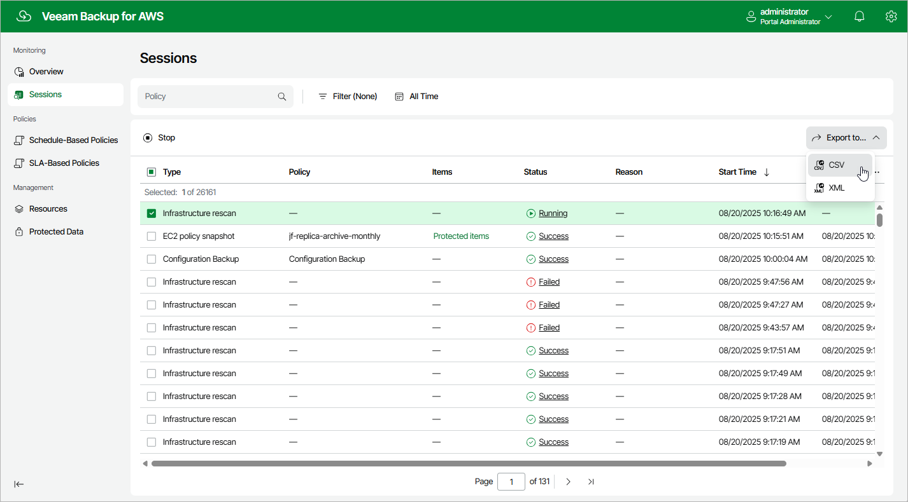

In this article

You can export properties of objects managed by Veeam Backup for AWS as a single file in the CSV or XML format. To do that, navigate to the necessary tab and click Export to. Veeam Backup for AWS will save the file with the exported data to the default download directory on the local machine.

|  |
| --- |
| Note |
| Even if you try to export properties of a specific object, Veeam Backup for AWS will still export all properties of all objects present on the currently opened tab. |

Page updated 8/21/2025

Page content applies to build 10.0.0.232
