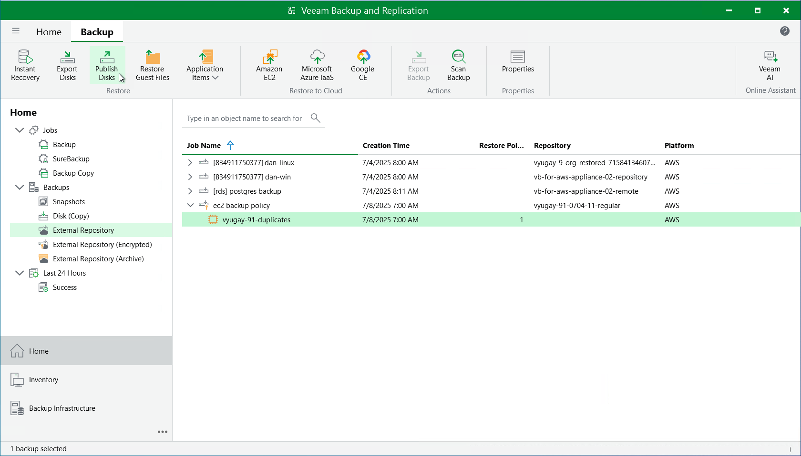

In this article

Veeam Backup & Replication allows you to publish point-in-time disks, that is, to mount specific EBS volumes of backed-up EC2 instances to any server to instantly access data in the read-only mode. You can copy the necessary files and folders to the target server, and perform an antivirus scan of the backed-up data. For more information, see the Veeam Backup & Replication User Guide, section [Disk Publishing (Data Integration API)](https://helpcenter.veeam.com/docs/vbr/userguide/data_integration_api.html?ver=13).

|  |
| --- |
| Important |
| Disk publishing can be performed only using backup files stored in standard backup repositories for which you have specified access keys of an IAM user whose permissions are used to access the repository. To learn how to specify credentials for the repositories, see sections [Creating New Repositories](add_s3_account.md) and [Connecting to Existing Appliances](connect_appliance_repo.md). |

To publish volumes of an EC2 instance, do the following:

1. In the Veeam Backup & Replication console, open the Home view.
2. Navigate to Backups > External Repository.
3. Expand the necessary backup policy, select the EC2 instance whose volumes you want to publish and click Publish Disks on the ribbon.
4. Complete the Publish Disks wizard as described in the Veeam Backup & Replication User Guide, section [Publishing Disks](https://helpcenter.veeam.com/docs/vbr/userguide/disk_export_machine.html?ver=13).

Page updated 1/5/2026

Page content applies to build 10.0.0.232
