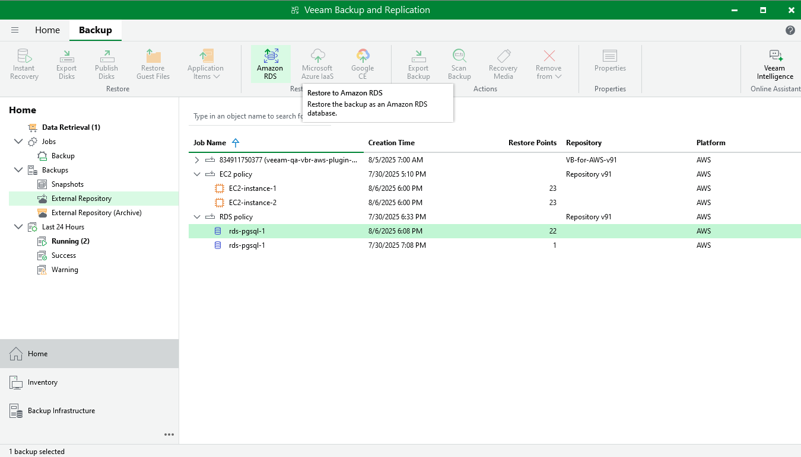

In this article

You can recover corrupted databases of a DB instance running the Microsoft SQL Server or PostgreSQL database engine from an image-level backup in the Veeam Backup for AWS Web UI only. However, you can launch the RDS Database Restore wizard directly from the Veeam Backup & Replication console to start the restore operation:

1. In the Veeam Backup & Replication console, open the Home view.
2. Navigate to Backups > External Repository.
3. Expand the backup policy that protects the database you want to recover, select the necessary database and click Amazon RDS on the ribbon.

Alternatively, you can right-click the selected database and click Restore to Amazon RDS.

Veeam Backup & Replication will open the RDS Database Restore wizard in a web browser. Complete the wizard as described in section [Performing Database Restore](performing_rds_database_restore.md).

Page updated 11/7/2025

Page content applies to build 10.0.0.232
