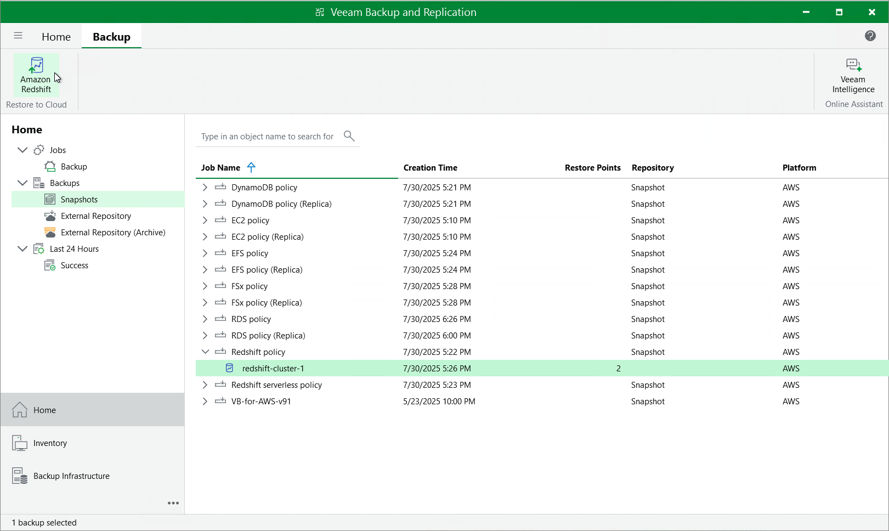

In this article

You can recover corrupted Redshift clusters in the Veeam Backup for AWS Web UI only. However, you can launch the Redshift Cluster Restore wizard directly from the Veeam Backup & Replication console to start the restore operation:

1. In the Veeam Backup & Replication console, open the Home view.
2. Navigate to Backups > Snapshots.
3. Expand the backup policy that protects the Redshift clusters you want to recover, select the necessary cluster and click Amazon Redshift on the ribbon.

Alternatively, you can right-click the selected cluster and click Restore to Amazon Redshift.

|  |
| --- |
| Important |
| You cannot restore multiple Redshift clusters from the Veeam Backup & Replication console. |

Veeam Backup & Replication will open the Redshift Cluster Restore wizard in a web browser. Complete the wizard as described in section [Redshift Restore Using Web UI](restore_point_redshift.md).

Page updated 10/6/2025

Page content applies to build 10.0.0.232
