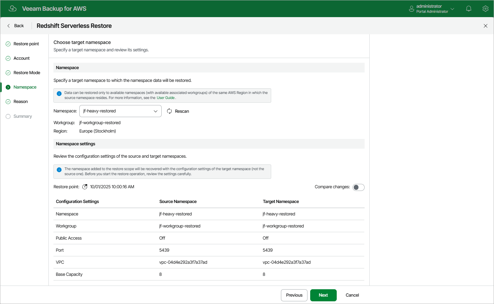

In this article

[This step applies only if you have selected the Restore to original or any existing namespace option at the Restore Mode step of the wizard]

At the Namespace step of the wizard, specify a namespace to which the backed-up data will be restored. To help you choose a namespace, Veeam Backup for AWS provides configuration settings on each available namespace.

For a namespace to be displayed in the Namespace drop-down list, it must be created (and be available) in the AWS Region in which the source namespace resides; the workgroup associated with the namespace must be available as well. To learn how to create Redshift Serverless namespaces, see [AWS Documentation](https://docs.aws.amazon.com/redshift/latest/mgmt/serverless-workgroup-namespace.html).

|  |
| --- |
| Tip |
| If want to quickly compare the configuration settings of the backed-up namespace with the configuration settings of the target namespace, set the Compare changes toggle to On. |

Page updated 10/1/2025

Page content applies to build 10.0.0.232
