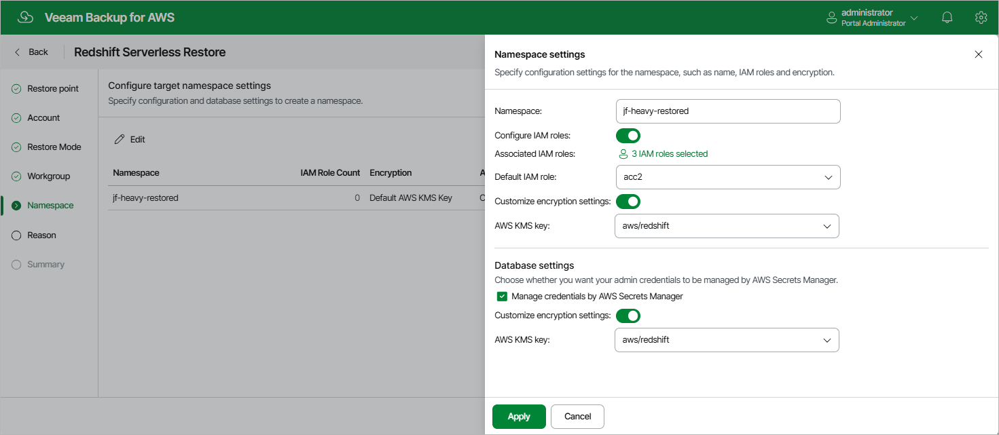

In this article

[This step applies only if you have selected the Restore to new namespace option at the Restore Mode step of the wizard]

|  |
| --- |
| Tip |
| As soon as you proceed to the Namespace step of the wizard, Veeam Backup for AWS will verify whether the original IAM roles associated with the source Redshift Serverless namespace added to the restore session still exist in the AWS infrastructure. If the associated roles do not exist in the AWS infrastructure anymore, you will receive a warning in the Associated IAM Roles column. To work around the issue, select other IAM roles to be associated with the new namespace.  You will also be able to proceed with the wizard and complete the restore operation without associating any new IAM roles. However, you will then need to associate the required roles with the namespace in the AWS Management Console as described in [AWS Documentation](https://docs.aws.amazon.com/redshift/latest/mgmt/default-iam-role.html?icmpid=docs_rs_console_hp_default-iam-role.html#associate-iam). |

By default, the new Redshift Serverless namespace will have the same settings as the source namespace. At the Namespace step of the wizard, you can adjust these settings:

1. Click Edit.
2. In the Namespace settings section, do the following:

1. In the Namespace field, enter a new name for the namespace. Note that the name must be unique in AWS.
2. To associate IAM roles with the restored namespace or to replace the original IAM roles that are already associated with the source namespace, set the Configure IAM roles toggle to On. Then, click the link next to the Associated IAM roles field, and select the necessary roles in the Select IAM Roles window. Note that the list of available roles shows all existing IAM roles from the same AWS account to which the source namespace belongs.

If you set the toggle to Off, the namespace will be restored without any associated IAM role.

1. To set one of the selected IAM roles as the default one, use the Default IAM role drop-down list. For more information on default IAM roles in Amazon Redshift, see [AWS Documentation](https://docs.aws.amazon.com/redshift/latest/mgmt/default-iam-role.html?icmpid=docs_rs_console_hp_default-iam-role.html#set-default-iam).
2. To change the key that is used for namespace encryption, set the Customize encryption settings toggle to On and choose the necessary custom key from the AWS KMS key list.

If you set the toggle to Off, the restored namespace will be encrypted with the default KMS key.

1. In the Database settings section, select the Manage credentials by AWS Secrets Manager check box if you want the admin password that was used to access databases of the source namespace to be managed by AWS Secrets Manager. If you select the check box, you can also choose a KMS key that will be used to encrypt the admin password:

* To use the default key, set the Customize encryption settings toggle to Off.
* To use a custom key, set the Customize encryption settings toggle to On and select the necessary key from the AWS KMS key drop-down list.

If you do not select the Manage credentials by AWS Secrets Manager check box, Veeam Backup for AWS will restore the namespace with the same admin credentials management option that was applied to the source namespace when the restore point was created.

|  |
| --- |
| Tip |
| For a KMS key to be displayed in the list of available encryption keys, it must be stored in the AWS Region where the source namespace resides, and the IAM role (or user) specified for the restore operation at [step 3](restore_account_redshift_serverless.md) of the wizard must have permissions to access the key.  If the necessary KMS key is not displayed in the list, or if you want to use a KMS key from an AWS account other than the AWS account to which the specified IAM role belongs, you can select Add custom key ARN from the AWS KMS key drop-down list, and specify the Amazon resource number (ARN) of the key in the Add Custom Key ARN window. For more information on KMS keys, see [AWS Documentation](https://docs.aws.amazon.com/kms/latest/developerguide/create-keys.html). |

The new namespace will be added to the AWS infrastructure only after you complete the restore wizard, and then the restore operation will start.

Page updated 10/1/2025

Page content applies to build 10.0.0.232
