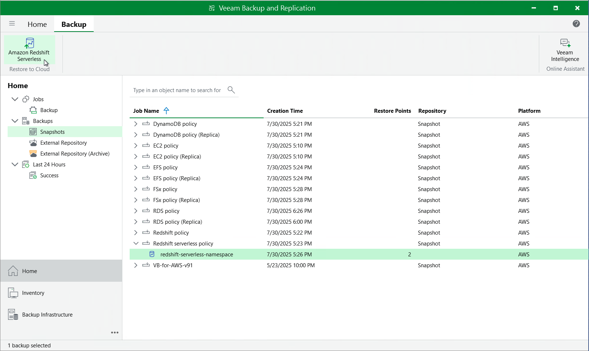

In this article

You can recover corrupted Redshift Serverless namespaces in the Veeam Backup for AWS Web UI only. However, you can launch the Redshift Serverless Restore wizard directly from the Veeam Backup & Replication console to start the restore operation:

1. In the Veeam Backup & Replication console, open the Home view.
2. Navigate to Backups > Snapshots.
3. Expand the backup policy that protects the Redshift Serverless namespaces you want to recover, select the necessary namespace and click Amazon Redshift Serverless on the ribbon.

Alternatively, you can right-click the selected namespace and click Restore to Amazon Redshift Serverless.

|  |
| --- |
| Important |
| Restoring multiple Redshift Serverless namespaces is not supported. |

Veeam Backup & Replication will open the Redshift Serverless Restore wizard in a web browser. Complete the wizard as described in section [Redshift Serverless Restore Using Web UI](restore_point_redshift_serverless.md).

Page updated 10/6/2025

Page content applies to build 10.0.0.232
