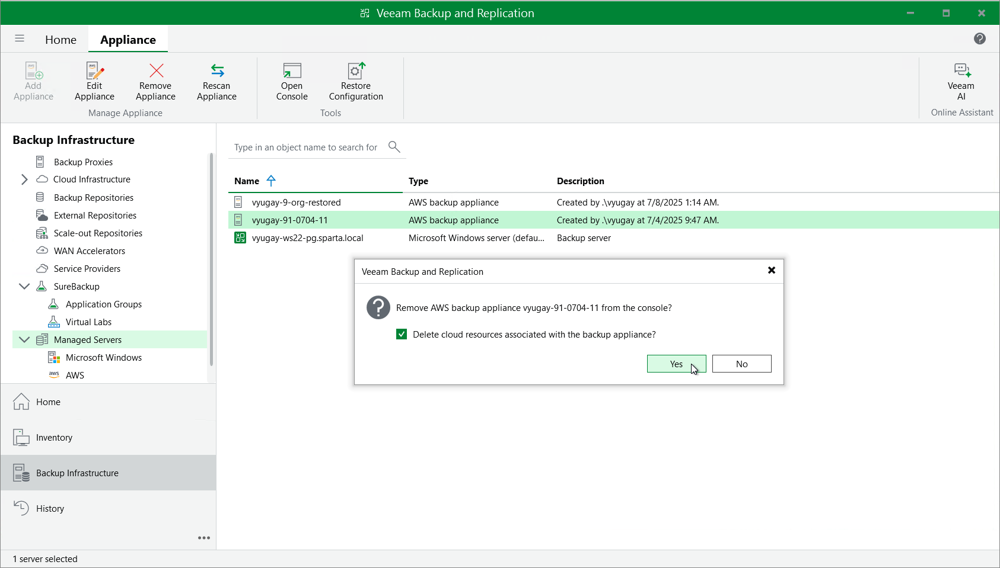

In this article

Veeam Plug-In for AWS allows you to permanently remove backup appliances from the backup infrastructure.

|  |
| --- |
| Note |
| After you remove a backup appliance, the following limitations will apply:   * Repositories for which you have not specified access keys of IAM users will be removed automatically from the backup infrastructure. * Repositories for which you have specified access keys of IAM users will remain in the backup infrastructure. However, you will have to rescan the repositories to collect information on all newly created and recently deleted (both manually and by retention) restore points. * You will not be able to manage backup policies created on the appliance. * You will not be able to restore EC2 instances from snapshots. * Restore to AWS from image-level backups will start working as described in the Veeam Backup & Replication User Guide, section [How Restore to Amazon EC2 Works](https://helpcenter.veeam.com/docs/vbr/userguide/restore_amazon_hiw.html?ver=13).   Also, the restore process will start taking more time to complete causing data transfer costs to increase as Veeam Backup & Replication will not be able to use native AWS capabilities and will have to process more data. |

To remove a backup appliance, do the following:

1. In the Veeam Backup & Replication console, open the Backup Infrastructure view.
2. Navigate to Managed Servers.
3. Select the necessary backup appliance and click Remove Appliance on the ribbon.

Alternatively, you can right-click the appliance and select Remove.

1. In the Veeam Backup & Replication window, click Yes to acknowledge the operation.

|  |
| --- |
| Tip |
| If you want to remove an appliance from both the backup infrastructure and AWS, select the Delete cloud resources associated with the backup appliance? check box in the opened window. Veeam Backup for AWS will remove all resources associated with this appliance in AWS.  However, if an appliance was deployed from the AWS Marketplace or was running Veeam Backup for AWS version 3.x (or earlier), to remove resources from AWS, you must follow the instructions provided in section [Appendix E. Uninstalling Backup Appliances Deployed from AWS Marketplace](uninstall.md). |

Page updated 8/8/2025

Page content applies to build 10.0.0.232
