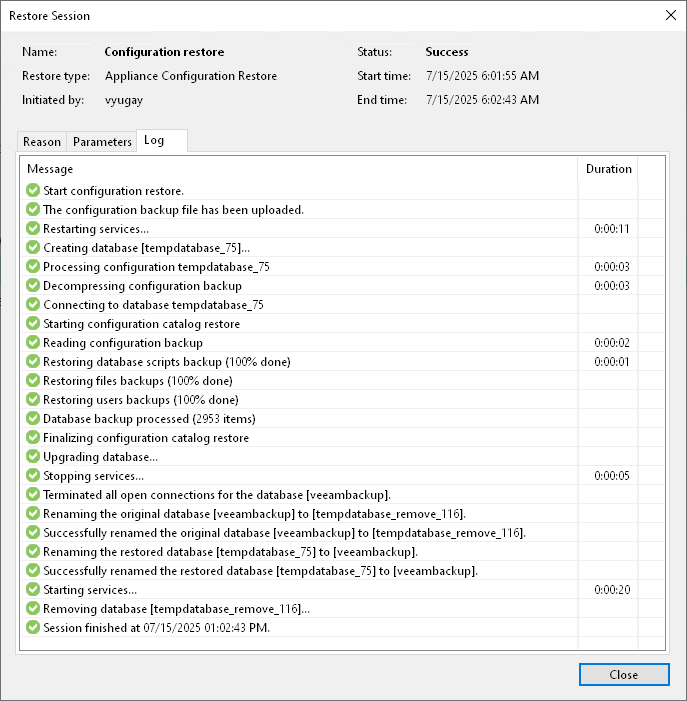
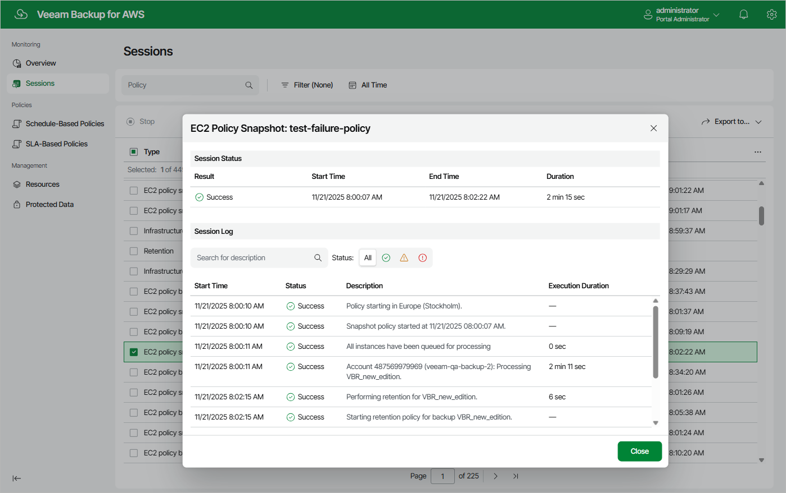

In this article

For each performed data protection or disaster recovery operation, Veeam Backup for AWS starts a new session and stores its records in the configuration database.

Viewing Session Statistics Using Console

You can track real-time statistics of all running and completed operations on the Jobs, Last 24 hours and Running nodes. For more information, see Veeam Backup & Replication User Guide, sections [Viewing Real-Time Statistics](https://helpcenter.veeam.com/docs/backup/vsphere/realtime_statistics.html?ver=120) and [Viewing Job Session Results](https://helpcenter.veeam.com/docs/backup/vsphere/session_results.html?ver=120).

Veeam Backup & Replication also allows you track statistics of data recovery operations initiated from Veeam Backup for AWS. To do that, do either of the following:

* In the Veeam Backup & Replication console, open the Home view and navigate to Last 24 hours. In the working area, double-click the necessary restore session.

Alternatively, select the session and click Statistics on the ribbon.

* In the Veeam Backup & Replication console, open the [History view](https://helpcenter.veeam.com/docs/backup/vsphere/views.html?ver=120) and navigate to Restore. In the working area, double-click the necessary restore session.

Alternatively, select the session and click Statistics on the ribbon.

The Restore Session window will display restore session details such as the name of the VM instance whose data is being restored, the account under which the session has started, the session status and duration, information on the restore point selected for the restore operation, and the list of tasks performed during the session.

Viewing Session Statistics Using Web UI

You can track real-time statistics of all running and completed operations on the Sessions page. To view the full list of tasks executed during an operation, click the link in the Status column. To view the full list of resources processed during an operation, click the link in the Items column.

|  |
| --- |
| Tips |
| * You can save the full list of sessions as a .CSV or .XML file. To do that, click Export to and select the necessary format.  * If you want to specify the time period during which Veeam Backup for AWS must keep session records in the configuration database, follow the instructions provided in section [Configuring Global Retention Settings](retention_settings.md). |

Page updated 11/21/2025

Page content applies to build 10.0.0.232
