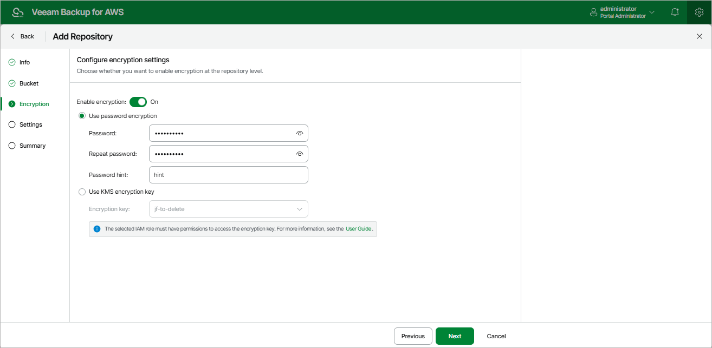

In this article

[This step applies only if you have selected the Create new folder option at the Bucket step of the wizard, or if you have selected an existing folder with encryption enabled at the repository level]

At the Encryption step of the wizard, do either of the following:

* If you have selected an existing folder at the Bucket step of the wizard, you must provide the currently used password or an encryption key that was used to encrypt data stored in this folder to let Veeam Backup for AWS access the folder and add it as a backup repository. You cannot change these settings while adding the repository — however, you will be able to [edit the repository settings](repositories_edit.md) later.

|  |
| --- |
| Important |
| Make sure that the encryption key that was used to encrypt data stored in the existing folder is available in AWS, and the IAM role specified at [step 3](repository_add_folder.md) of the wizard has permissions to access the key. Otherwise, Veeam Backup for AWS will not be able to add the repository to the backup infrastructure. |

* If you have selected the Create new folder option at the Bucket step of the wizard, choose whether you want to encrypt backup files stored in the selected Amazon S3 bucket folder. Before you enable encryption at the repository level, check the limitations described in section [Limitations and Considerations](repository_add_limitations.md#encryption).

To enable encryption:

1. Set the Enable encryption toggle to On.

1. Choose whether you want to use a password or an [AWS Key Management Service (KMS) key](https://docs.aws.amazon.com/kms/latest/developerguide/concepts.html) to encrypt the backed-up data. For more information on encryption algorithms, see [Backup Repository Encryption](encryption_repository_level.md).

* To encrypt data using a password, select the Use password encryption option and specify the password and a password hint.
* To encrypt data using an AWS KMS key, select the Use KMS encryption key option and choose the necessary KMS key from the Encryption key drop-down list.

For a KMS key to be displayed in the list of available encryption keys, it must be created in the AWS Region where the selected Amazon S3 bucket is located, and the IAM role specified at [step 3](repository_add_folder.md#Role) of the wizard must have permissions required to access the key. For more information on the required permissions, see [Repository IAM Role Permissions](role_permissions_repo.md).

Page updated 10/14/2025

Page content applies to build 10.0.0.232
