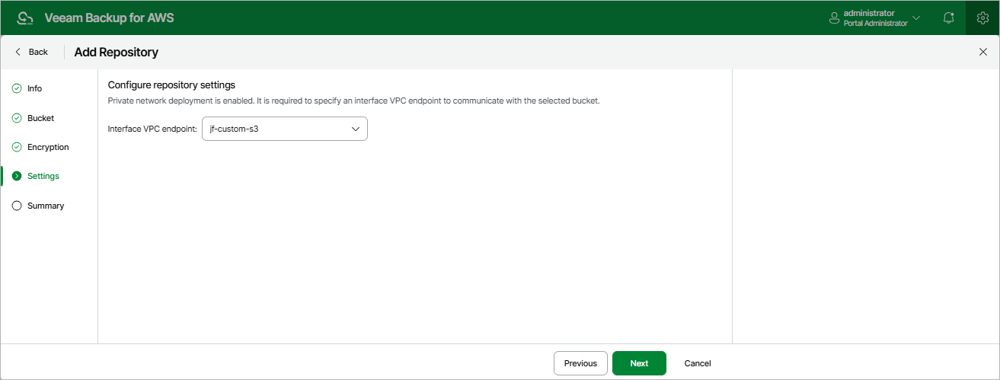

In this article

[This step applies only if you have enabled the [private network deployment](enable_private_network_deployment.md) functionality]

At the Settings step of the wizard, specify an S3 interface endpoint that will be used to communicate with the Amazon S3 service.

For an S3 interface endpoint to be displayed in the Interface VPC endpoint list, it must be created in the Amazon VPC console for all subnets to which the worker instances will be connected, as described in section [Configuring Private Networks](configuring_private_networks.md#private_network).

|  |
| --- |
| Important |
| S3 gateway endpoints are not supported when using the private network deployment functionality. |

Page updated 8/20/2025

Page content applies to build 10.0.0.232
