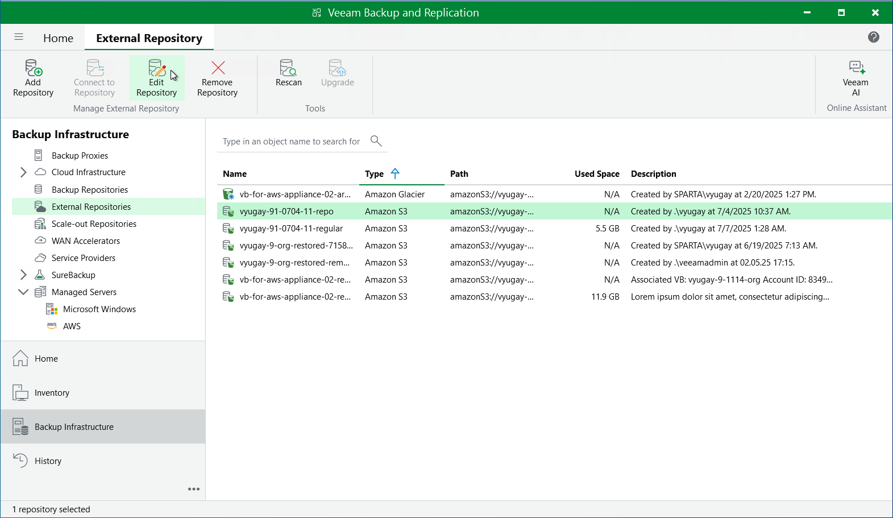
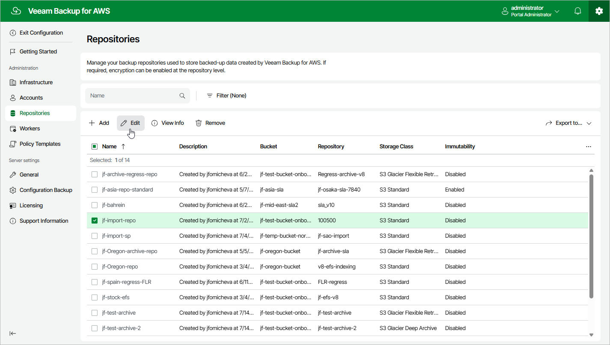

In this article

The settings that you can modify for a backup repository depend on whether the repository has been added to the backup infrastructure using the Veeam Backup & Replication console or the Veeam Backup for AWS Web UI.

Editing Backup Repository Settings Using Veeam Backup & Replication Console

For each standard backup repository, you can modify settings configured while adding the repository to the backup infrastructure:

1. In the Veeam Backup & Replication console, open the Backup Infrastructure view.
2. Navigate to External Repositories.
3. Select the necessary repository and click Edit Repository on the ribbon.

Alternatively, you can right-click the repository and select Properties.

1. Complete the Edit External Repository wizard:

1. To specify a new name and description for the repository, follow the instructions provided in section [Creating New Repositories](add_s3_appliance.md) (step 2).
2. To change the access keys of the IAM user and the gateway server used to access the repository, follow the instructions provided in section [Creating New Repositories](add_s3_account.md) (step 3).
3. To enable encryption or change the encryption settings of the repository, follow the instructions provided in section [Creating New Repositories](add_s3_encryption.md) (step 6).

|  |
| --- |
| Important |
| If you change the encryption settings of the repository from the Veeam Backup & Replication console, Veeam Backup & Replication will not propagate these settings to the backup appliance automatically. Consider updating the settings manually as described in [Editing Backup Repository Settings Using Veeam Backup for AWS Web UI](#editing_repo_settings). |

1. At the Apply step of the wizard, wait for the changes to be applied and click Next.
2. At the Summary step of the wizard, review summary information and click Finish to confirm the changes.

Editing Backup Repository Settings Using Veeam Backup for AWS Web UI

For each backup repository, you can modify settings configured while adding the repository to Veeam Backup for AWS:

1. Switch to the Configuration page.

1. Navigate to Repositories.

1. Select the backup repository and click Edit.

1. Complete the Edit Repository wizard.

1. To provide a new name and description for the backup repository, follow the instructions provided in section [Adding Backup Repositories Using Web UI](repository_add_name.md) (step 2).
2. To change the IAM role whose permissions Veeam Backup for AWS uses to access the repository, follow the instructions provided in section [Adding Backup Repositories Using Web UI](repository_add_folder.md#Role) (step 3).
3. [Applies only to repositories managed by another backup appliance] To change the owner of the backup repository, navigate to the Bucket step and click Next. Then, follow the instructions provided in section [Adding Backup Repositories Using Web UI](repository_owner.md) (step 3).
4. To enable data encryption or change the configured encryption settings, follow the instructions provided in section [Adding Backup Repositories Using Web UI](repositories_add_encryption.md) (step 4).
5. To specify the S3 interface endpoint that will be used to communicate with the Amazon S3 service in private deployment mode, follow the instructions provided in section [Adding Backup Repositories Using Web UI](repositories_add_s3endpoint.md) (step 5).
6. At the Summary step of the wizard, review summary information, choose whether you want to proceed to the [Session Log page](reporting.md#ui) to track the progress of modifying the backup repository settings, and click Finish to confirm the changes.

Page updated 10/14/2025

Page content applies to build 10.0.0.232
