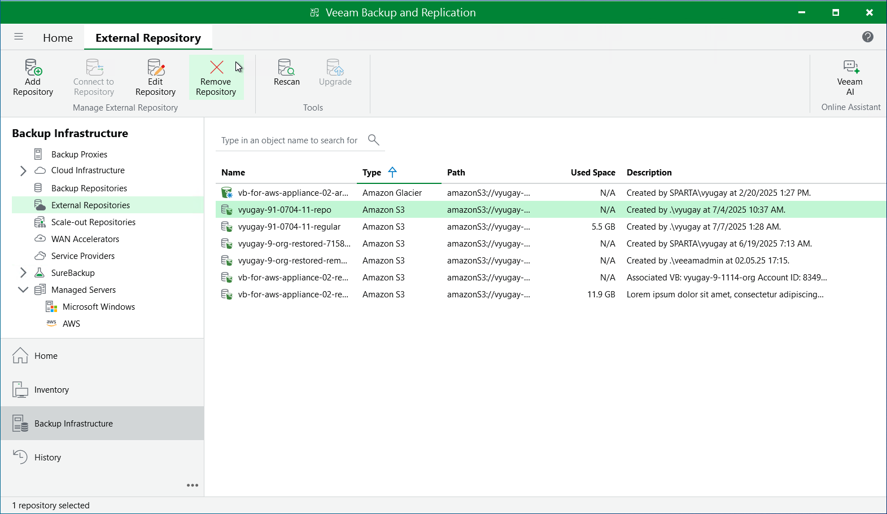
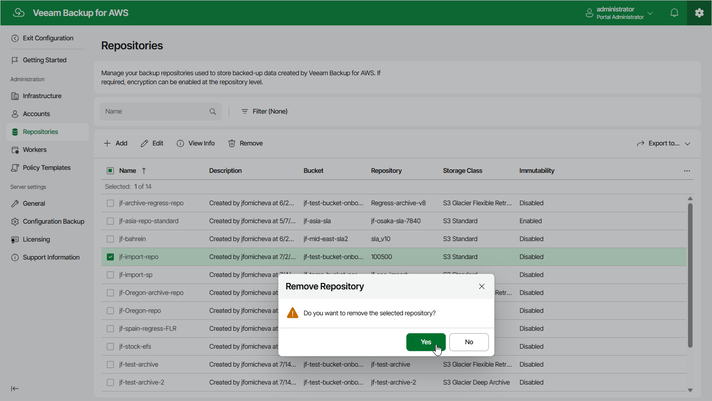

In this article

The consequences of actions performed with a backup repository depend on whether the repository has been added to the backup infrastructure using the Veeam Backup & Replication console or the Veeam Backup for AWS Web UI.

Removing Backup Repository Using Veeam Backup & Replication Console

Veeam Plug-In for AWS allows you to permanently remove repositories from the backup infrastructure:

1. In the Veeam Backup & Replication console, open the Backup Infrastructure view.
2. Navigate to External Repositories.rescanning\_repository.png
3. Select the necessary repository and click Remove Repository on the ribbon.

Alternatively, you can right-click the repository and select Remove.

Note that the repository will not be removed from the backup appliance. To learn how to remove repositories from backup appliances, see [Removing Backup Repository Using Veeam Backup for AWS Web UI.](#remove_repo_from_web_ui)

Removing Backup Repository Using Veeam Backup for AWS Web UI

You can remove backup repositories from Veeam Backup for AWS. When you remove a repository, Veeam Backup for AWS unassigns the repository role from the folder in the Amazon S3 bucket so that this folder is no longer used as a backup repository.

|  |
| --- |
| Note |
| Even though the Amazon S3 bucket is no longer used as a backup repository, Veeam Backup for AWS preserves all backup files previously stored in the repository and keeps these files in Amazon S3. You can assign the Amazon S3 bucket to a new backup repository so that Veeam Backup for AWS imports the backed-up data to the configuration database. In this case, you will be able to perform all disaster recovery operations described in section [Performing Restore](recovery.md).  If you no longer need the backed-up data, either delete it as described in section [Managing Backed-Up Data](backups_view.md) before you remove the repository from Veeam Backup for AWS, or [use the AWS Management Console](uninstall.md#removeData) to delete the data if the repository has already been removed. |

To remove a backup repository, do the following:

1. Switch to the Configuration page.

1. Navigate to Repositories.

1. Select the check box next to the backup repository and click Yes.

1. In the Remove Repository window, click Remove to acknowledge the operation.

|  |
| --- |
| Important |
| You cannot remove a backup repository that is used by any backup policy or by a scheduled configuration backup. Modify the settings of all the related policies to remove references to the repository — and then try removing the repository again. To learn how to modify the backup policy settings, see [Performing Backup](backup.md). |

Page updated 8/20/2025

Page content applies to build 10.0.0.232
