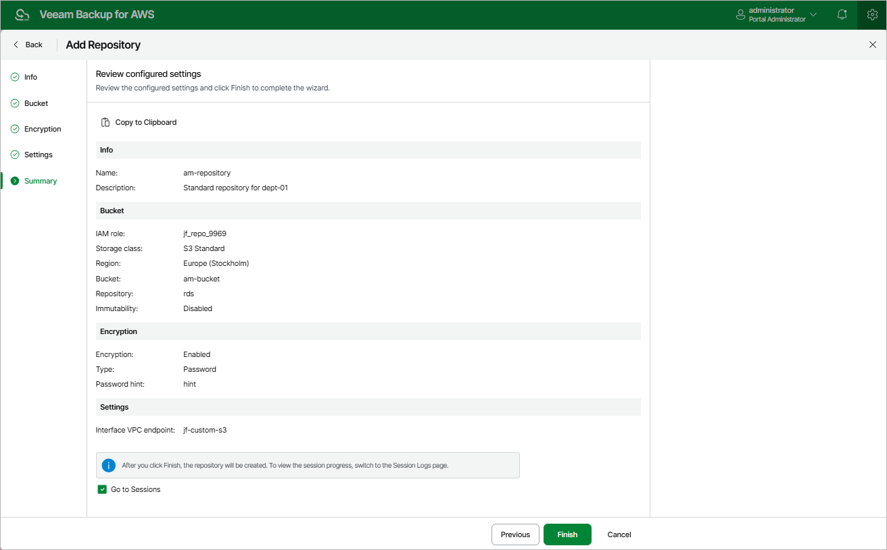

In this article

At the Summary step of the wizard, review summary information, choose whether you want to proceed to the [Sessions page](reporting.md#ui) to track the progress of repository creation, and click Finish.

Page updated 8/20/2025

Page content applies to build 10.0.0.232
