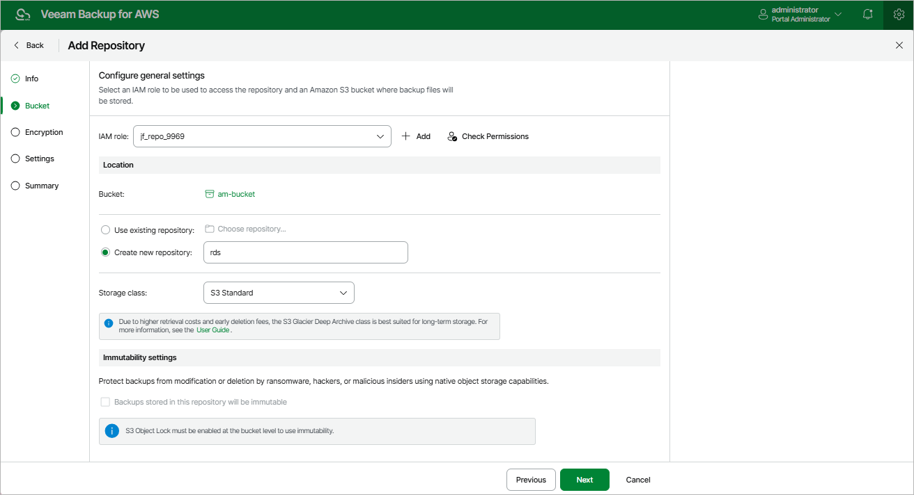

In this article

At the Bucket step of the wizard, specify an IAM role that will be used to access the created repository, choose an Amazon S3 bucket in which the repository will be created, and review immutability settings for the repository.

Specifying IAM Role

In the IAM role section, specify an IAM role whose permissions Veeam Backup for AWS will use to create the new repository in the target Amazon S3 bucket and further to access the repository when performing data protection and recovery tasks. It is recommended that you check whether the selected IAM role has all the permissions required to perform the operation. To do that, click Check Permissions and follow the instructions provided in section [Checking IAM Role Permissions](iam_roles_check.md#wizard). For more information on the required permissions, see [Repository IAM Role Permissions](role_permissions_repo.md).

For an IAM role to be displayed in the IAM role list, it must be added to Veeam Backup for AWS with the Repository role selected as described in section [Adding IAM Roles](iam_roles_add.md). If you have not added the necessary IAM role to Veeam Backup for AWS beforehand, you can do it without closing the Add Repository wizard. To do that, click Add and complete the Add IAM Role wizard.

Choosing Repository Location

In the Location section, do the following:

1. Specify an Amazon S3 bucket where you want to store backups.

1. Click the Choose bucket link.
2. In the Choose bucket window, select an Amazon S3 bucket that will be used as a target location for backups, and click Apply.

For an Amazon S3 bucket to be displayed in the Bucket list, it must be created within an AWS account to which the specified IAM role belongs. To learn how to create Amazon S3 buckets, see [AWS Documentation](https://docs.aws.amazon.com/AmazonS3/latest/dev/UsingBucket.html#create-bucket-intro).

It may take some time for Veeam Backup for AWS to retrieve information about existing Amazon S3 buckets from AWS.

|  |
| --- |
| Important |
| If you have any S3 Lifecycle configuration associated with the selected Amazon S3 bucket, make sure that the lifecycle rules do not apply to the backup files created by the backup appliance. Otherwise, the backup files may be unexpectedly deleted or transitioned to another storage class, and the backup appliance will not be able to access the files. For more information on managing S3 Lifecycle configurations, see [AWS Documentation](https://docs.aws.amazon.com/AmazonS3/latest/userguide/how-to-set-lifecycle-configuration-intro.html). |

1. Choose whether you want to use an existing folder inside the selected Amazon S3 bucket or to create a new one to group backup files stored in the bucket.

* To use an existing folder, select the Use existing repository option and click Choose repository. In the Choose repository window, select the necessary folder and click Apply. Keep in mind [limitations and considerations](repository_add_limitations.md#folder) for existing repository folders.

For a folder to be displayed in the Repository list, it must have been created by any backup appliance as a repository (either existing or already removed from the backup infrastructure) in the selected Amazon S3 bucket.

* To create a new folder, select the Create new repository option and specify a name for the new folder. The maximum length of the name is 125 characters; the slash (/) character is not supported.

1. [Applies only if you have selected the Create new repository option] From the Storage class drop-down list, select a storage class for the backup repository:

* To store backups in the S3 Standard storage class — a high-availability and high-performance storage that you plan to access frequently, select S3 Standard.
* To store backups in the S3 Glacier Flexible Retrieval storage class — a secure, durable and low-cost archive storage that you plan to access infrequently, select S3 Glacier Flexible Retrieval.
* To store backups in the S3 Glacier Deep Archive storage class — the lowest-cost archive storage that you plan to access once or twice a year, select S3 Glacier Deep Archive.

For more information on Amazon S3 storage classes, see [AWS Documentation](https://aws.amazon.com/s3/storage-classes/).

|  |
| --- |
| Note |
| When you select the S3 Glacier Flexible Retrieval or S3 Glacier Deep Archive option for a backup repository, Veeam Backup for AWS does not create any S3 Glacier vaults in your AWS environment — it assigns the selected storage class to backups stored in the repository. That is why the archived backups remain in Amazon S3 and cannot be accessed directly through the Amazon S3 Glacier service. |

Reviewing Immutability Settings

Veeam Backup for AWS allows you to protect backups stored in the repository from being lost as a result of malware, ransomware or any other malicious actions. To do that, you can create repositories with [immutability](immutability.md) enabled. For more information on requirements and limitations, see [Limitations and Considerations](repository_add_limitations.md#immutability).

|  |
| --- |
| Note |
| For security reasons, it is recommended that you store immutable backup files in a dedicated AWS account. To do that, specify an IAM role that belongs to the necessary account as described in section [Specifying IAM Role](#Role), and then choose an Amazon S3 bucket that meets the immutability requirements. |

As soon as you choose an Amazon S3 bucket, Veeam Backup for AWS verifies the immutability settings configured at the bucket level, and displays the following information in the Immutability section:

* If both S3 Versioning and S3 Object Lock are enabled for the specified bucket, and the default retention period is not configured in the Object Lock settings, Veeam Backup for AWS automatically selects the Backups stored in this repository will be immutable check box. In this case, the repository will be created with immutability enabled. For more information, see [Immutability](immutability.md).
* If S3 Object Lock is disabled and S3 Versioning is disabled (or suspended) for the specified bucket, Veeam Backup for AWS automatically clears the Backups stored in this repository will be immutable check box. In this case, the repository will be created with immutability disabled.
* If none of the cases apply, Veeam Backup for AWS raises an error notifying that the bucket cannot be used to create the repository. In this case, either choose another Amazon S3 bucket or reconfigure the bucket settings in the AWS Management Console.

|  |
| --- |
| Important |
| It is recommended that S3 Object Lock and S3 Versioning are either both enabled or both disabled for the selected bucket. Otherwise, enabling S3 Versioning alone will significantly increase the amount of space consumed by backups stored in the bucket. |

For more information on the S3 Versioning and S3 Object Lock features, see [AWS Documentation](https://docs.aws.amazon.com/AmazonS3/latest/userguide/managing-storage.html).

|  |
| --- |
| Note |
| As soon as you click Next, Veeam Backup for AWS will check the repository ownership. If the backup repository is already managed by another backup appliance, you will receive a warning. To learn how to eliminate this warning, see [Eliminating Repository Ownership Warning](repository_owner.md). |

Page updated 12/10/2025

Page content applies to build 10.0.0.232
