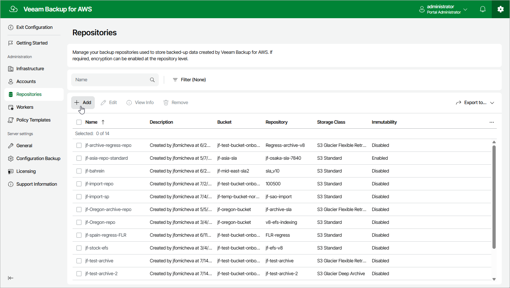

In this article

To launch the Add Repository wizard, do the following:

1. Switch to the Configuration page.

1. Navigate to Repositories.

1. Click Add.

Page updated 8/20/2025

Page content applies to build 10.0.0.232
