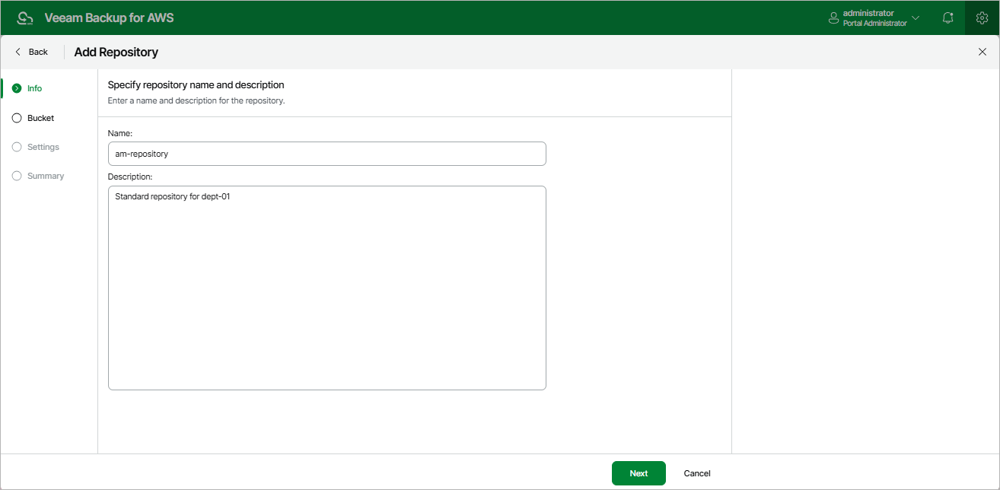

# Step 2. Specify Repository Name and Description

At the Info step of the wizard, use the Name and Description fields to enter a name for the new backup repository and to provide a description for future reference. The name must be unique in Veeam Backup for AWS; the maximum length of the name is 125 characters; the maximum length of the description is 1024 characters.

