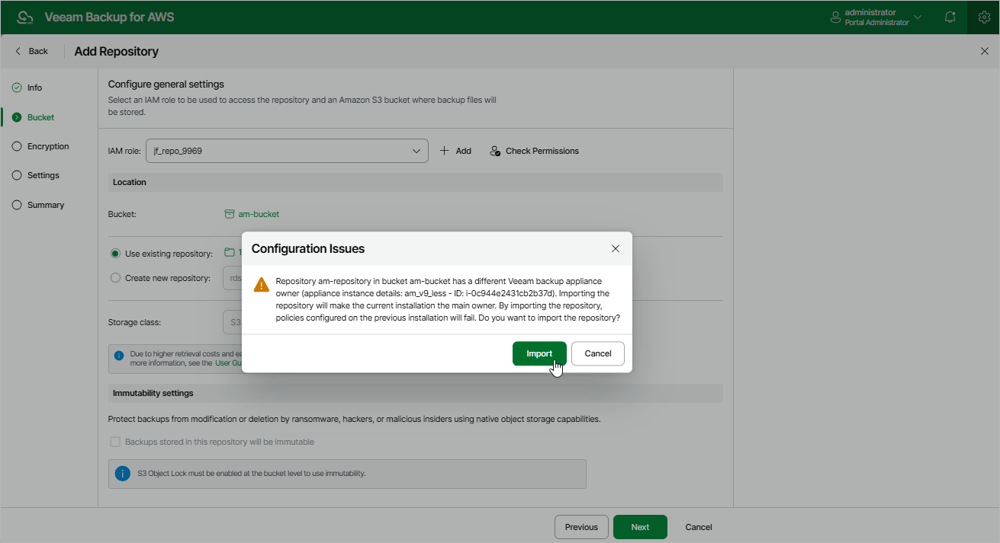

In this article

Due to technical limitations, a backup repository that is already added to a backup appliance cannot be added to other backup appliances. Otherwise, retention sessions running on different appliances may corrupt backup files stored in this repository, which may result in unpredictable data loss. For this reason, Veeam Backup for AWS checks whether a repository is managed by any appliances as soon as you click Next at the at the Bucket step of the wizard.

|  |
| --- |
| Note |
| The repository ownership check is supported only for those backup repositories that are managed by backup appliances running Veeam Backup for AWS version 7.0 or later. |

If the backup repository is already added to another backup appliance, Veeam Backup for AWS will display a warning notifying that the repository has an owner. If you want the current appliance to become the owner of the repository, click Import. If you want to preserve the repository ownership, click Cancel and choose another folder as a target backup repository.

|  |
| --- |
| Important |
| If you chose to import the backup repository, consider the following:   * The previous backup appliance will lose the repository ownership and you will have to reconfigure the repository settings on that appliance. Otherwise, backup policies configured on the appliance will start failing. * After importing a backup repository that stores indexes of EFS file systems, the indexes may be automatically removed from the repository within 5 days if the backup appliance does not rescan the associated EFS backups. To work around the issue, either import the backup repository to the original backup appliance, or make sure that the AWS Region to which the EFS backups belong is included in an EFS backup policy configured on the current backup appliance — this will allow the appliance to rescan the region and re-associate the backups with their indexes. |

Page updated 8/20/2025

Page content applies to build 10.0.0.232
