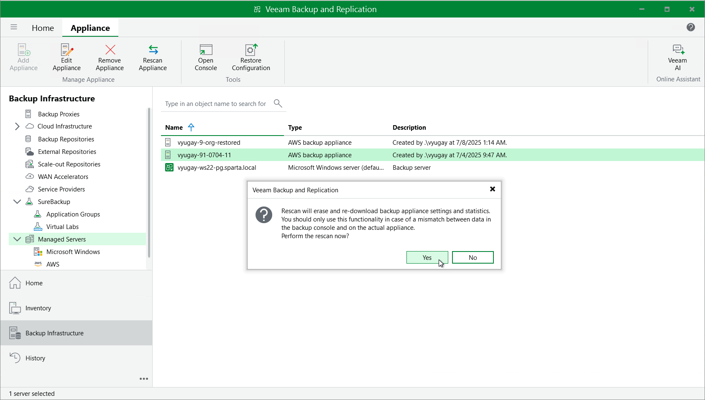

In this article

If a backup appliance becomes unavailable, you can rescan the appliance:

1. In the Veeam Backup & Replication console, open the Backup Infrastructure view.
2. Navigate to Managed Servers.
3. Select the necessary backup appliance and click Rescan appliance on the ribbon.

Alternatively, you can right-click the appliance and select Rescan.

1. In the opened window, click Yes.

Veeam Backup & Replication will remove all data collected from the appliance configuration database. Then, Veeam Backup & Replication will recollect session results for the past 48 hours, as well as information on all snapshots, backups and policies.

|  |
| --- |
| Note |
| The rescan operation cannot be performed for available backup appliances and appliances that require upgrade. To learn how to upgrade backup appliances, see [Upgrading Appliances Using Console](upgrade_appliance_console.md). |

Page updated 7/9/2025

Page content applies to build 10.0.0.232
