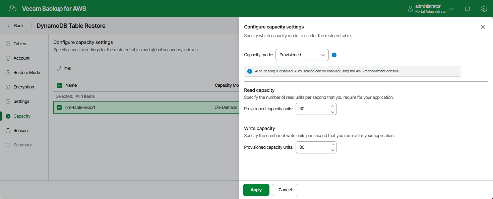

In this article

[Applies only if you have selected the Restore to new location, or with different settings option at the Restore Mode step of the wizard]

At the Capacity step of the wizard, you can change the capacity mode and configure provisioned capacity settings for the restored table. To do that, select the table and click Edit.

|  |
| --- |
| Note |
| You can change the capacity mode only once within 24 hours. For more information on table capacity modes, see [AWS Documentation](https://docs.aws.amazon.com/amazondynamodb/latest/developerguide/CostOptimization_TableCapacityMode.html). |

If you have selected the Provisioned capacity mode option, specify the value of the capacity units in the Read capacity and Write capacity fields. For more information on considerations and limitations when decreasing throughput for provisioned tables, see [AWS Documentation](https://docs.aws.amazon.com/amazondynamodb/latest/developerguide/ServiceQuotas.html#default-limits-throughput).

Page updated 10/1/2025

Page content applies to build 10.0.0.232
