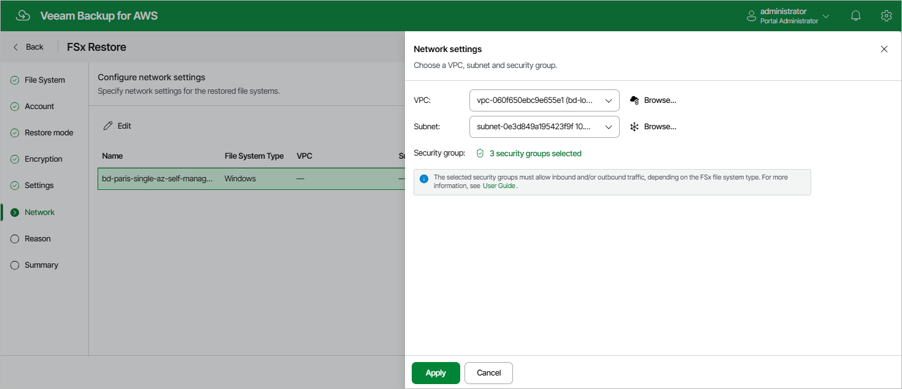

In this article

[This step applies only if you have selected the Restore to new location, or with different settings option at the Restore Mode step of the wizard]

At the Network step of the wizard, configure network settings for the restored file system. To do that:

1. Select the file system and click Edit.
2. In the Network settings window, do the following:

1. From the VPC drop-down list, select an Amazon VPC network to which the restored FSx file system will be connected.

For a VPC network to be displayed in the list of available networks, it must be created in the AWS Region specified at [step 4](restore_mode_fsx.md) of the wizard as described in [AWS Documentation](https://docs.aws.amazon.com/vpc/latest/userguide/create-vpc.html).

1. [Applies only to the file systems with the Single-AZ deployment type] From the Subnet drop-down list, select a subnet in which the elastic network interface of the file system will reside.

For a subnet to be displayed in the list of available subnets, it must be created in the AWS Region specified at [step 4](restore_mode_fsx.md) of the wizard as described in [AWS Documentation](https://docs.aws.amazon.com/vpc/latest/userguide/create-subnets.html).

1. [Applies only to file systems with the Multi-AZ deployment type] From the Preferred subnet and Standby subnet drop-down lists, select subnets in which the network interfaces of the primary and standby file servers will reside.

For a subnet to be displayed in the list of available subnets, it must be created for the preferred Availability Zone in the specified VPC network as described in [AWS Documentation](https://docs.aws.amazon.com/vpc/latest/userguide/create-subnets.html).

1. Click the link next to the Security group filed. In the opened window, select security groups that will be associated with the restored file system. Note that you cannot associate more than 5 security groups.

For a security group to be displayed in the list of available groups, it must be created in the AWS Region specified at [step 4](restore_mode_fsx.md) of the wizard as described in [AWS Documentation](https://docs.aws.amazon.com/vpc/latest/userguide/working-with-security-groups.html#creating-security-groups).

1. [Applies only to file systems of the Amazon FSx for OpenZFS file system type] Click the link next to the Route tables filed. In the opened window, select a route table that will be associated with the subnet of the specified VPC network.

For a route table to be displayed in the list of available tables, it must be created in the AWS Region specified at [step 4](restore_mode_fsx.md) of the wizard as described in [AWS Documentation](https://docs.aws.amazon.com/vpc/latest/userguide/WorkWithRouteTables.html).

1. Click Apply.

|  |
| --- |
| Important |
| * Preferred and standby subnets must reside in different Availability Zones within the same AWS Region selected at [step 4](restore_mode_fsx.md) of the wizard.  * The selected security group must meet requirements described in section [Protecting FSx File Systems](overview_fsx.md#reqs). |

Page updated 10/1/2025

Page content applies to build 10.0.0.232
