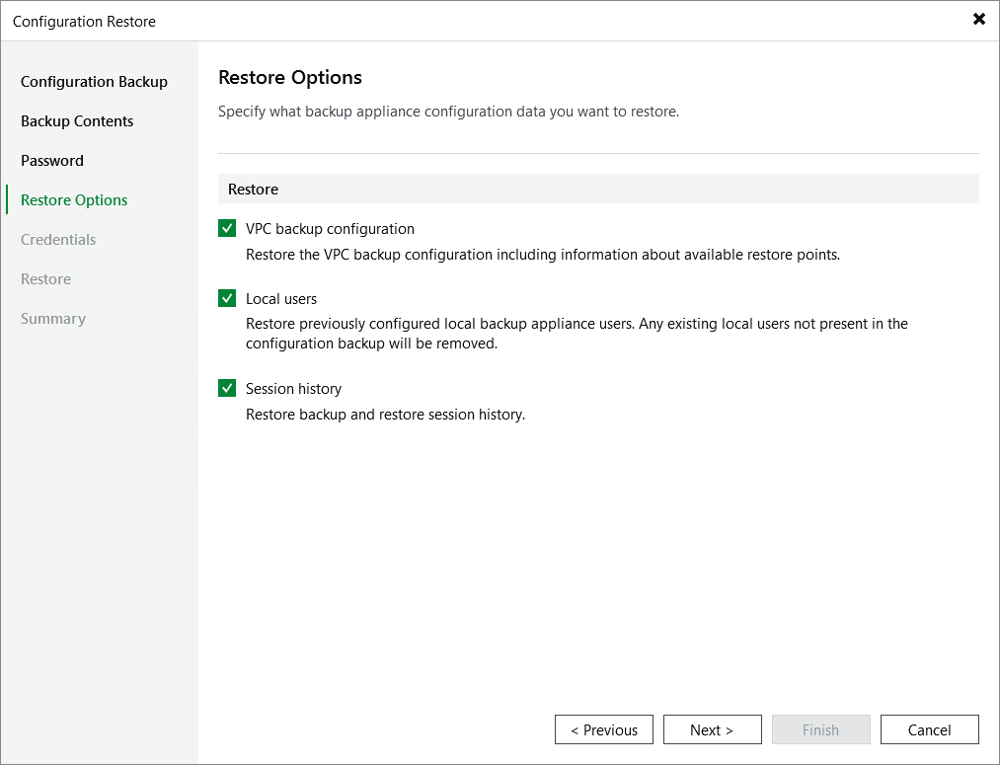

In this article

By default, Veeam Backup & Replication restores configuration data for the existing infrastructure components, created backup policies, configured global settings. At the Restore Options step of the wizard, you can choose whether you want to restore VPC configuration backups, portal users of the source backup appliance and session logs as well.

If you select the VPC backup configuration check box, Veeam Backup & Replication will restore VPC configurations of AWS Regions added to a backup policy running on the initial backup appliance and information on available restore points. If you select the Local users check box, Veeam Backup & Replication will restore all Portal Administrators, Portal Operators and Restore Operators saved to the configuration backup file — and overwrite the currently added portal users. If you select the Session history option, Veeam Backup & Replication will restore backup sessions, restore sessions, rescan sessions and service sessions — in this case, the restore process may take more time to complete.

|  |
| --- |
| Important |
| After you click Next, the restore process will start. You will not be able to halt the process or edit the restore settings. |

Page updated 9/2/2025

Page content applies to build 10.0.0.232
