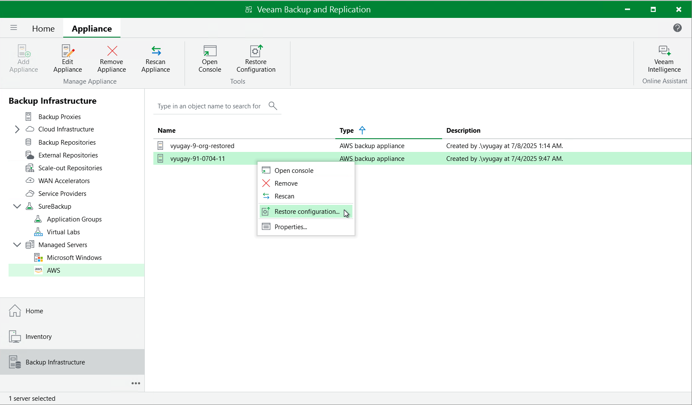

In this article

To launch the Configuration Restore wizard, do the following:

1. In the Veeam Backup & Replication console, open the Backup Infrastructure view.
2. Navigate to Managed Servers > AWS.
3. Select a backup appliance for which you want to perform the restore operation, and click Restore Configuration on the ribbon.

Alternatively, you can right-click the necessary appliance and select Restore configuration.

Page updated 7/15/2025

Page content applies to build 10.0.0.232
