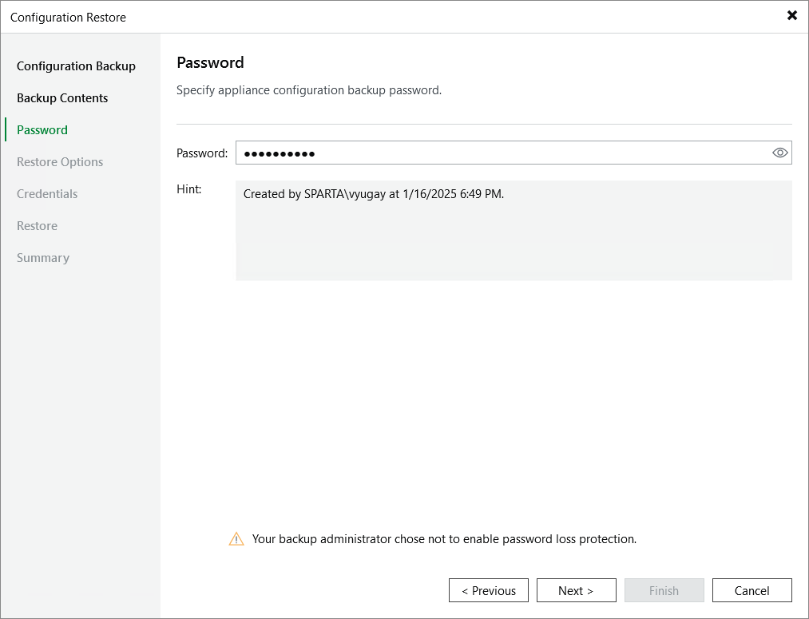

In this article

At the Password step of the wizard, specify a password used to encrypt the configuration backup.

If you do not remember the password, you can restore configuration backup data without providing it. To do that, click the I forgot the password link and follow the instructions provided in the Veeam Backup & Replication User Guide, section [Decrypting Data Without Password](https://helpcenter.veeam.com/docs/vbr/userguide/decrypt_without_pass.html?ver=13).

|  |
| --- |
| Note |
| To restore configuration data without a password, the following requirements must be met:   * You must have either the Veeam Universal License or a legacy socket-based license (Enterprise edition or higher) installed on the backup server. * The backup server must be connected to Veeam Backup Enterprise Manager, and password loss protection must be enabled on the Veeam Backup Enterprise Manager side for the duration of both the backup and restore operations. For more information, see the [Veeam Backup Enterprise Manager Guide](https://helpcenter.veeam.com/docs/backup/em/em_manage_keys.html?ver=120). |

Page updated 9/2/2025

Page content applies to build 10.0.0.232
