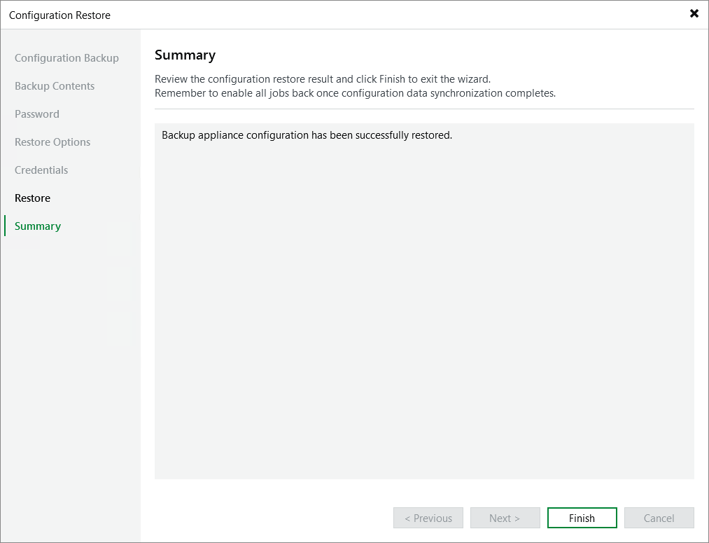

In this article

At the Summary step of the wizard, click Finish to finalize the process of configuration data restore.

If Veeam Backup & Replication encounters an issue while performing configuration restore, the wizard will display the Open backup appliance console and validate the restored configuration manually link. This link redirects you to the Veeam Backup for AWS Web UI where you can view the details on the occurred issues. To learn how to resolve issues, see [Restoring Configuration Data Using Web UI](config_restore_verification.md).

Page updated 9/2/2025

Page content applies to build 10.0.0.232
