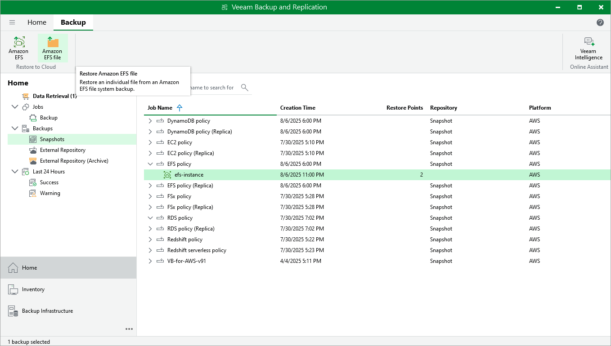

In this article

You can perform EFS file-level restore only using the Veeam Backup for AWS Web UI. However, you can launch the EFS file-level recovery wizard directly from the Veeam Backup & Replication console. To do that, do the following:

1. In the Veeam Backup & Replication console, open the Home view.
2. Navigate to Backups > Snapshots.
3. Expand the EFS backup policy that protects a file system whose files and folders you want to restore, select the necessary file system and click Amazon EFS file on the ribbon.

Alternatively, you can right-click the file system and select Restore to Amazon EFS files.

Veeam Backup & Replication will open the EFS File-level Recovery wizard in a web browser. Complete the wizard as described in section [Performing File-Level Recovery](restore_item_settings.md).

Page updated 8/7/2025

Page content applies to build 10.0.0.232
