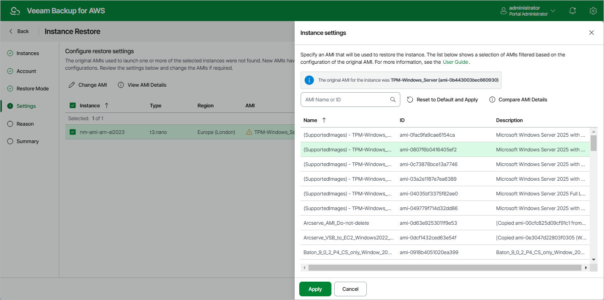

In this article

[This step applies only if you have selected the Restore to original option at the Restore Mode step of the wizard, and if the original Amazon machine image (AMI) that was used to launch the source instance has not been found]

At the Settings step of the wizard, select an AMI whose configuration will be used to launch the restored EC2 instance.

By default, Veeam Backup for AWS automatically chooses an AMI whose configuration is similar to the configuration of the restored instance. If Veeam Backup for AWS fails to choose an AMI automatically or you want to specify an AMI manually, click Change AMI. For an AMI to be displayed in the list of available AMIs, it must exist in the same AWS account and region in which the source instance resides.

|  |
| --- |
| Tip |
| When displaying the list of available AMIs, Veeam Backup for AWS applies a number of filtering criteria (such as architecture, hypervisor, virtualization type, boot mode and so on) to avoid misconfiguration issues. If the AMI that you want to use to launch the restored EC2 instance is not displayed in the list, you can try entering its ID in the search field of the Instance settings window — in this case, Veeam Backup for AWS will return the AMI without applying any filtering criteria. |

Page updated 9/29/2025

Page content applies to build 10.0.0.232
