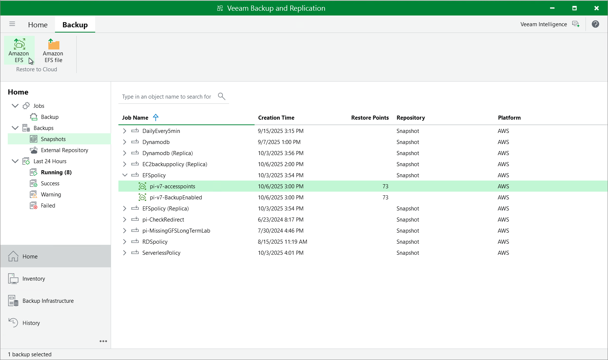

In this article

You can recover corrupted EFS file systems in the Veeam Backup for AWS Web UI. However, you can launch the EFS Restore wizard directly from the Veeam Backup & Replication console. To do that, do the following:

1. In the Veeam Backup & Replication console, open the Home view.
2. Navigate to Backups > Snapshots.
3. Expand the EFS backup policy that protects a file system you want to restore, select the necessary file system and click Amazon EFS on the ribbon.

Alternatively, you can right-click the file system and select Restore to Amazon EFS.

Veeam Backup & Replication will open the EFS Restore wizard in a web browser. Complete the wizard as described in section [EFS Restore Using Web UI](restore_entire_point_efs.md).

Page updated 10/6/2025

Page content applies to build 10.0.0.232
