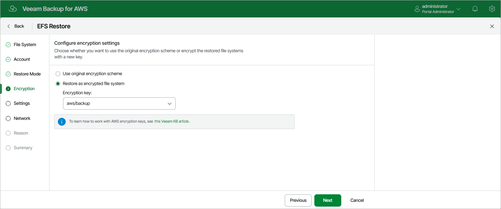

In this article

[This step applies only if you have selected the Restore to new location, or with different settings option at the Restore Mode step of the wizard]

At the Encryption step of the wizard, choose whether the restored file system will be encrypted with an AWS KMS key:

* If you do not want to encrypt the file system or want to apply the existing encryption scheme, select the Use original encryption scheme option.
* If you want to encrypt the file system, select the Restore as encrypted file system option and choose the necessary KMS key from the Encryption key drop-down list.

For a KMS key to be displayed in the list of available encryption keys, it must be stored in the AWS Region selected at [step 4](restore_entire_mode_efs.md) of the wizard, and the IAM role or user specified for the restore operation at [step 3](restore_entire_account_efs.md) of the wizard must have permissions to access the key. For more information on KMS keys, see [AWS Documentation](https://docs.aws.amazon.com/kms/latest/developerguide/create-keys.html).

|  |
| --- |
| Tip |
| If the necessary KMS key is not displayed in the list, or if you want to use a KMS key from an AWS account other than the AWS account to which the specified IAM role belongs, you can select Add custom key ARN from the Encryption key drop-down list, and specify the amazon resource name (ARN) of the key in the Add Custom Key ARN window.  For Veeam Backup for AWS to be able to encrypt the restored file system using the provided KMS key, either the IAM role or user specified for the restore operation, or the IAM role used to create the restore point selected at [step 2](restore_entire_point_efs.md) of the wizard must have permissions to access the key. |

Page updated 10/1/2025

Page content applies to build 10.0.0.232
