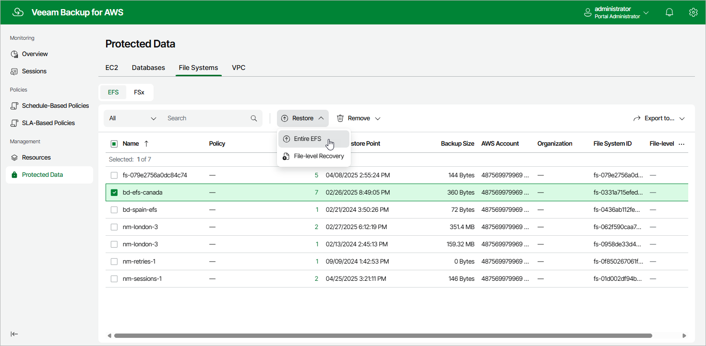

In this article

To launch the EFS Restore wizard, do the following:

1. Navigate to Protected Data > File Systems > EFS.

1. Select the EFS file system that you want to restore.
2. Click Restore > Entire EFS.

Alternatively, click the link in the Restore Points column. Then, in the Available Restore Points window, select the necessary restore point and click Restore > Entire EFS.

|  |
| --- |
| Note |
| You can restore multiple EFS file systems if they belong to same AWS account only. |

Page updated 10/1/2025

Page content applies to build 10.0.0.232
