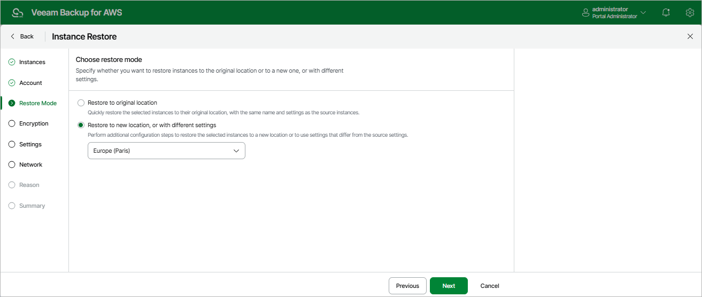

In this article

At the Restore Mode step of the wizard, choose whether you want to restore the selected EC2 instance to the original or to a custom location. If you select the Restore to new location, or with different settings option, specify the target AWS Region where the restored EC2 instance will operate.

|  |
| --- |
| Important |
| * For Veeam Backup for AWS to be able to perform restore to the original location, the IAM role specified at the [Account](restore_entire_account.md) step of the wizard must belong to the AWS account to which the source EC2 instance belongs.  * Veeam Backup for AWS does not support restore to the original location if the source EC2 instance is still present in the location and [stop protection](https://docs.aws.amazon.com/AWSEC2/latest/UserGuide/ec2-stop-protection.html) or [termination protection](https://docs.aws.amazon.com/AWSEC2/latest/UserGuide/terminating-instances.html#Using_ChangingDisableAPITermination) are enabled for the instance.   For more information on limitations and considerations, see [Before You Begin](restore_entire_before_you_begin.md). |

Page updated 9/29/2025

Page content applies to build 10.0.0.232
