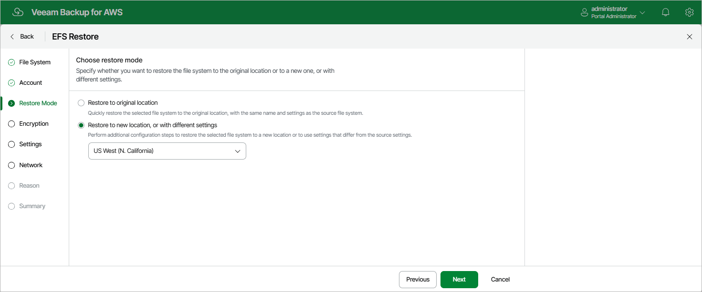

In this article

At the Restore Mode step of the wizard, choose whether you want to restore the selected EFS file system to the original or to a custom location. If you select the Restore to a new location, or with different settings option, specify the target AWS Region where the restored file system will reside.

Page updated 10/1/2025

Page content applies to build 10.0.0.232
