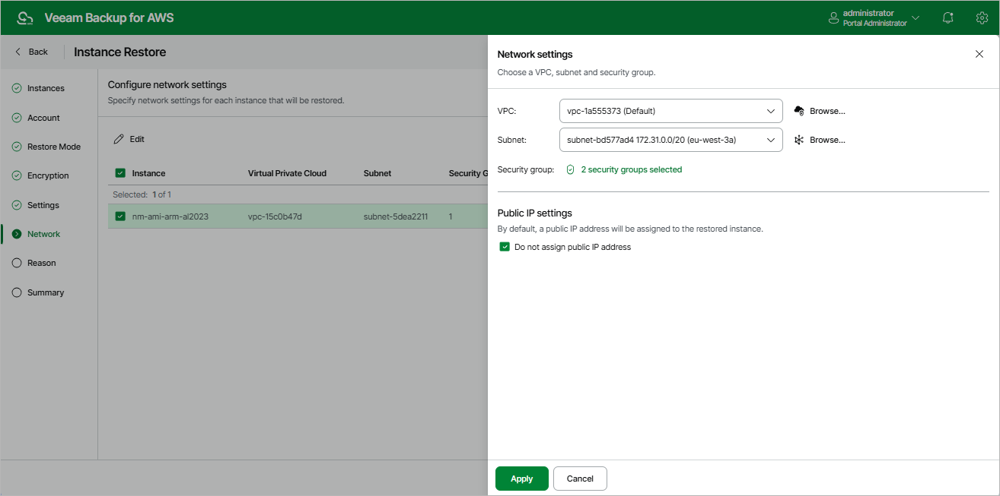

In this article

[This step applies only if you have selected the Restore to new location, or with different settings option at the Restore Mode step of the wizard]

At the Network step of the wizard, do the following for each EC2 instance in the list:

1. Select an EC2 instance and click Edit.
2. In the Network settings section of the opened window, choose an Amazon VPC network to which the restored EC2 instance will be connected, select a subnet in which the EC2 instance will be launched and specify security groups that will be associated with the restored EC2 instance. To select security groups, click Browse to the right of Security group. Then, in the Select Security Group window, add security groups that must be associated with the instance, and click Save.

For a VPC network, subnet and security group to be displayed in the lists of available network specifications, they must be created in the AWS Region specified at [step 5](restore_entire_mode.md) of the wizard as described in [AWS Documentation](https://docs.aws.amazon.com/vpc/latest/userguide/what-is-amazon-vpc.html).

|  |
| --- |
| Important |
| When Veeam Backup for AWS backs up EC2 instances with IPv6 addresses assigned, it does not save the addresses. That is why when you restore these instances, IP addresses are assigned according to the settings specified in AWS for the subnet to which the instances are restored. |

1. In the Public IP settings section of the opened window, choose whether you want Veeam Backup for AWS to assign a public IP address to the restored instance.

Related Resources

* [What Is Amazon VPC](https://docs.aws.amazon.com/vpc/latest/userguide/what-is-amazon-vpc.html)
* [VPCs and Subnets](https://docs.aws.amazon.com/vpc/latest/userguide/VPC_Subnets.html)
* [Security Groups](https://docs.aws.amazon.com/vpc/latest/userguide/VPC_SecurityGroups.html)

Page updated 10/2/2025

Page content applies to build 10.0.0.232
