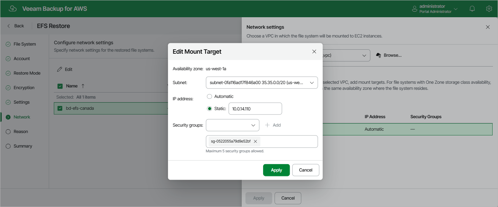

In this article

[This step applies only if you have selected the Restore to new location, or with different settings option at the Restore Mode step of the wizard]

At the Network step of the wizard, configure network and mount target settings for the restored file system.

Choose Virtual Private Cloud

Specify an Amazon VPC network to which the restored EFS file system must be connected:

1. In the Network section, click Edit Network Settings.
2. In the Network specifications window, select the necessary Amazon VPC network.

For a VPC network to be displayed in the VPC list, it must be created in the AWS Region specified at [step 4](restore_entire_mode_efs.md) of the wizard as described in [AWS Documentation](https://docs.aws.amazon.com/vpc/latest/userguide/what-is-amazon-vpc.html).

1. Click Apply.

Configure Mount Targets

Configure settings for mount targets that will be created for the restored file system:

1. Click the link in the Mount targets section.
2. In the Mount targets specification window, click Add.
3. In the Add Mount Target window, do the following:

1. From the Availability zone drop-down list, select an Availability Zone where the mount target will be created.
2. From the Subnet drop-down list, select a subnet to which the mount target will be connected.

For a subnet to be displayed in the Subnet list, it must be created for the selected Availability Zone in the specified VPC network as described in [AWS Documentation](https://docs.aws.amazon.com/vpc/latest/userguide/what-is-amazon-vpc.html).

1. In the IP address section, choose one of the following options:

* Automatic — if you want an IP address to be automatically assigned to the mount target.
* Static — if you want to specify a static IP address for the mount target.

1. Add security groups to control inbound and outbound access to the restored file system. To do that, from the Security groups drop-down list, select a security group that will be associated with the mount target and click Add. Note that you cannot add more than 5 security groups.

For a security group to be displayed in the Security groups list, it must be created in the AWS Management Console as described in [AWS Documentation](https://docs.aws.amazon.com/efs/latest/ug/accessing-fs-create-security-groups.html).

1. To save the mount target configuration, click Add.

1. To save the changes made to the mount target settings, click Apply.

Page updated 10/1/2025

Page content applies to build 10.0.0.232
