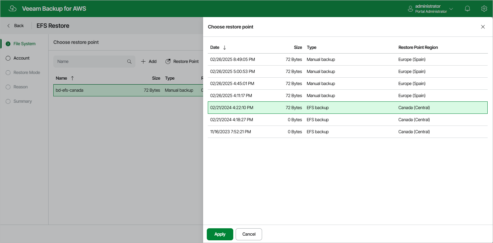

In this article

At the File System step of the wizard, you can add EFS file systems to the restore session and select restore points to be used to perform the restore operation for each added file system. By default, Veeam Backup for AWS uses the most recent valid restore point. However, you can restore a file system to an earlier state.

To select a restore point, do the following:

1. Select the EFS system and click Restore Point.
2. In the Choose restore point window, select the necessary restore point and click Apply.

To help you choose a restore point, Veeam Backup for AWS provides the following information on each available restore point:

* Date — the date when the restore point was created.

* Size — the size of the restore point.
* Type — the type of the restore point:

* EFS backup — an EFS backup created by a backup policy.
* EFS backup copy — a backup copy created by a backup policy.
* Manual backup — an EFS backup created manually.

* Restore Point Region — the AWS Region where the restore point is stored.

Page updated 10/1/2025

Page content applies to build 10.0.0.232
