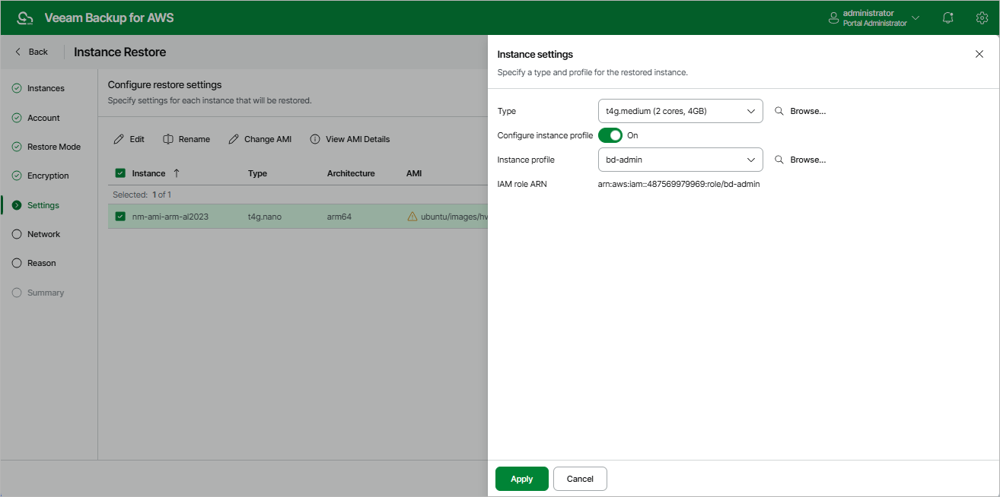

In this article

[This step applies only if you have selected the Restore to new location, or with different settings option at the Restore Mode step of the wizard]

|  |
| --- |
| Tip |
| As soon as you proceed to the Settings of the wizard, Veeam Backup for AWS will verify whether the original instance profiles attached to EC2 instances added to the restore session still exist in the AWS infrastructure, and whether the original IAM roles associated with these profiles have not been replaced or removed. If any of the conditions is not met, you will receive a warning in the Instance Profile column. To work around the issue, you can do either of the following:   * If an instance profile does not exist in the AWS infrastructure anymore, select another instance profile to be attached to the restored EC2 instance. Alternatively, proceed with the wizard to complete the restore operation without any profile attached. * If the IAM role associated with an instance profile has been replaced or removed, select another instance profile that contains the required role, or replace the role associated with the profile in the AWS Management Console as described in [AWS Documentation](https://docs.aws.amazon.com/AWSEC2/latest/UserGuide/iam-roles-for-amazon-ec2.html#replace-iam-role). |

At the Settings step of the wizard, do the following for each EC2 instance added to the restore session:

1. Select the EC2 instance.
2. If you want to specify a new name for the restored EC2 instance, click Rename.
3. If you want to configure type and profile settings for the restored EC2 instance, click Edit. For the list of all existing instance types, see [AWS Documentation](https://aws.amazon.com/ec2/instance-types/).

To attach an instance profile to the restored EC2 instance or to replace the original instance profile that is already attached to the instance, set the Configure instance profile toggle to On and then select the necessary profile from the Instance profile drop-down list. If you set the Instance profile toggle to Off, the instance will be restored without any profile attached. For more information on instance profiles, see [AWS Documentation](https://docs.aws.amazon.com/IAM/latest/UserGuide/id_roles_use_switch-role-ec2_instance-profiles.html).

1. If you want to specify an Amazon machine image (AMI) for the restored EC2 instance, click Change AMI. For an AMI to be displayed in the list of available AMIs, it must exist in the target AWS account and AWS Region selected at [step 5](restore_entire_mode.md) of the wizard.

Note that Veeam Backup for AWS automatically chooses either the AMI that was used to launch the source instance or an AMI whose configuration is similar to the configuration of the restored instance (if the original AMI has not been found).

|  |
| --- |
| Tip |
| When displaying the list of available AMIs, Veeam Backup for AWS applies a number of filtering criteria (such as architecture, hypervisor, virtualization type, boot mode and so on) to avoid misconfiguration issues. If the AMI that you want to use to launch the restored EC2 instance is not displayed in the list, you can try entering its ID in the search field of the Instance settings window — in this case, Veeam Backup for AWS will return the AMI without applying any filtering criteria. |

Page updated 9/29/2025

Page content applies to build 10.0.0.232
