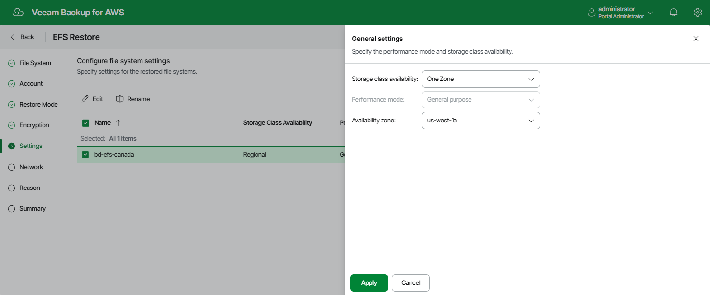

In this article

[This step applies only if you have selected the Restore to new location, or with different settings option at the Restore Mode step of the wizard]

At the Settings step of the wizard, you can specify new names and configuration settings for the restored file system.

To specify a new name, select the file system and click Rename. In the File system name window, specify the name and click Apply.

To specify configuration settings, do the following:

1. Select the file system and click Edit.
2. In the General Settings window, do the following:

1. From the Storage class availability drop-down list, select one of the following options:

* Regional — if you want to redundantly store data of the restored file system across all Availability Zones within the selected AWS Region.

* One Zone — if you want to redundantly store data of the restored file system within a single Availability Zone.

1. [Applies only if you have selected the Regional option] From the Performance mode drop-down list, select a performance mode for the restored file system. For more information on performance modes, see [AWS Documentation](https://docs.aws.amazon.com/efs/latest/ug/performance.html#performancemodes).
2. [Applies only if you have selected the One Zone option] From the Availability zone drop-down list, select an Availability Zone where the restored file system will be located.

1. To save changes made to the file system settings, click Apply.

Page updated 10/1/2025

Page content applies to build 10.0.0.232
