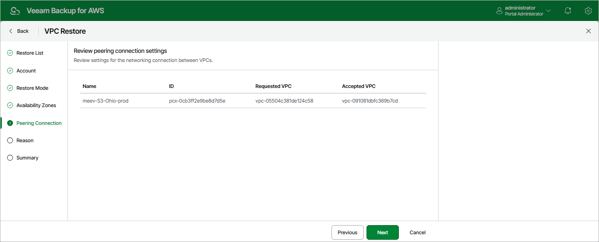

In this article

[This step applies only if you have selected the Restore to a new location, or with different settings option at the Restore Mode step of the wizard]

At the Peering Connection step of the wizard, review preconfigured VPC peering connection settings. You cannot modify the settings for the restored VPC configuration — by default, Veeam Backup for AWS will restore VPC peering connections as follows:

* If you restore both VPCs between which you have created a peering connection, Veeam Backup for AWS will create a peering connection between the restored VPCs in the target AWS Region.
* If you restore a VPC that has a peering connection to a VPC in the same AWS Region, Veeam Backup for AWS will create an inter-region peering connection between the restored VPC in the target AWS Region and the VPC with which the source VPC is peered in the source AWS Region.
* If you restore a VPC that has a peering connection to a VPC in another AWS Region, Veeam Backup for AWS will create an inter-region peering connection between the restored VPC in the target AWS Region and the VPC with which the source VPC is peered in the other AWS Region.

|  |
| --- |
| Note |
| VPC peering connections will have the Pending Acceptance status after restoring. To accept the restored VPC peering connections, use the AWS Management Console. For more information, see [AWS Documentation](https://docs.aws.amazon.com/vpc/latest/peering/create-vpc-peering-connection.html). |

Page updated 10/1/2025

Page content applies to build 10.0.0.232
