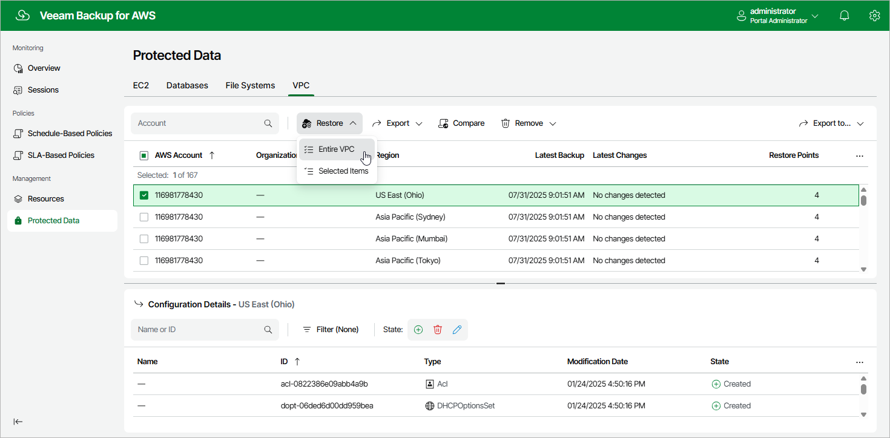

In this article

To launch the VPC Restore wizard, do the following:

1. Navigate to Protected Data > VPC.
2. Select the configuration record for an AWS Region whose VPC configuration you want to restore.
3. Click Restore > Entire VPC.

Page updated 10/1/2025

Page content applies to build 10.0.0.232
