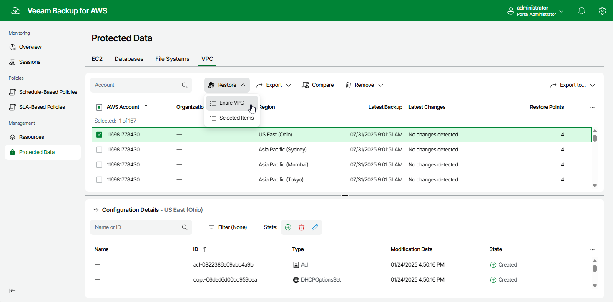

# Step 1. Launch VPC Restore Wizard

To launch the VPC Restore wizard, do the following:

1. Navigate to Protected Data > VPC.
2. Select the configuration record for an AWS Region whose VPC configuration you want to restore.
3. Click Restore > Entire VPC.

