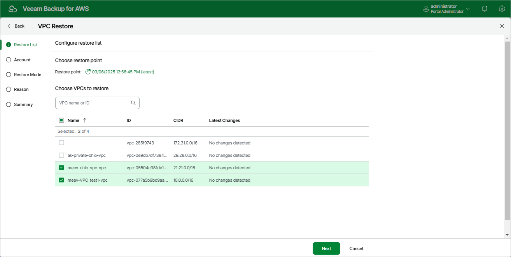

In this article

At the Restore List step of the wizard, select a restore point that will be used to restore the selected VPC configuration. By default, Veeam Backup for AWS uses the most recent valid restore point. However, you can restore the VPC configuration data to an earlier state.

To select a restore point, do the following:

1. In the Choose restore point section, click the link next to the Restore point field.
2. In the Available restore points window, select the necessary restore point and click Apply.
3. In the Choose VPCs to restore section, select VPCs whose configuration you want to restore.

Page updated 10/1/2025

Page content applies to build 10.0.0.232
