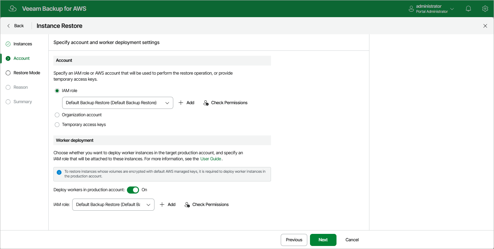

In this article

[This step applies only if you restore EC2 instances from image-level backups using either the IAM role or the Organization account option]

By default, Veeam Backup for AWS deploys worker instances used to perform restore operations in the [backup account](worker_options.md). However, you can instruct Veeam Backup for AWS to deploy worker instances in a production account — that is, an account to which the EC2 instances will be restored. To do that, set the Deploy workers in production account toggle to On.

Depending on the option that you select for the restore operation, the following will happen:

* If you select the IAM role option, you will be able to choose an IAM role that will be attached to the worker instances and used by Veeam Backup for AWS to communicate with these instances. The role you choose must belong to the same account to which the IAM role specified for the restore operation belongs, and must be assigned the permissions listed in section [Worker Deployment Role Permissions in Production Accounts](role_permissions_prod_acc.md#worker_reqs).

For an IAM role to be displayed in the list of available roles, it must be added to Veeam Backup for AWS with the Production worker role selected as described in section [Adding IAM Roles](https://helpcenter.veeam.com/docs/vbaws/guide/iam_roles_add.html). If you have not added the necessary IAM role to Veeam Backup for AWS beforehand, you can do it without closing the Add Policy wizard. To do that, click Add and complete the Add IAM Role wizard.

* If you have selected the Organization option, Veeam Backup for AWS will automatically choose an IAM role that will be attached to the worker instances and used by Veeam Backup for AWS to communicate with these instances. It will be one of the roles specified in the settings of the selected organization identity — either the IAM role whose permissions will be used to perform the backup operation (that is, the Backup and restore IAM role), or the IAM role that will be attached to the worker instances and used by Veeam Backup for AWS to communicate with these instances (that is, the Production worker IAM role).

For Veeam Backup for AWS to be able to choose an IAM role automatically, it must be created in all AWS accounts belonging to the selected organization identity, and specified in the organization settings as described in section [Adding AWS Organizations](organization_add_settings.md#backup_role) (step 3).

In both cases, you will have to assign additional permissions to the IAM role that will be used to perform the restore operation. For more information on the required permissions, see [EC2 Restore IAM Permissions](role_permissions_restore_ec2.md).

|  |
| --- |
| Important |
| If you select the IAM role option, it is recommended that you check whether both the IAM role that will be used to perform the restore operation and the IAM role that will be attached to the worker instances have the required permissions — if some of the permissions are missing, the restore operation may fail to complete successfully. To run the IAM role permission check, click Check Permissions and follow the instructions provided in section [Checking IAM Role Permissions](iam_roles_check.md#wizard). |

Page updated 11/21/2025

Page content applies to build 10.0.0.232
