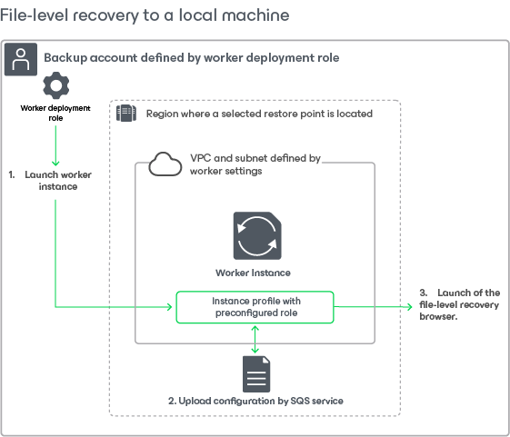
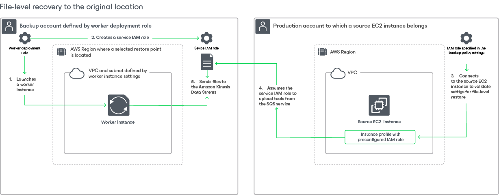

In this article

To recover files and folders of a backed-up EC2 instance, Veeam Backup for AWS performs the following steps:

1. Deploys a worker instance in either of the following AWS Regions:

* To restore files and folders from a cloud-native snapshot, manual cloud-native snapshots or a snapshot replicas, Veeam Backup for AWS deploys the worker instance in the AWS Region where the source EC2 snapshot or snapshot replica resides.
* To restore files and folders from an image-level backup, Veeam Backup for AWS deploys the worker instance in the AWS Region where the backup repository with backed-up data resides.

1. Attaches and mounts EBS volumes of the EC2 instance to the worker instance.

[Applies only if you restore files and folders from an image-level backup] EBS volumes are not physically extracted from the backup — Veeam Backup for AWS emulates their presence on the worker instance. The source backup itself remains in the read-only state.

1. [Applies only if you perform restore to the original location] Installs the Veeam restore tool on the source EC2 instance.
2. Launches the file-level recovery browser.

The file-level recovery browser displays the file system tree of the backed-up EC2 instance. In the browser, you can select the necessary files and folders to restore.

1. Downloads the selected files and folders to the local machine.
2. [Applies only if you perform restore to the original location] Restores the selected files and folders to the source EC2 instance, or downloads them to the local machine.
3. Unmounts and detaches EBS volumes of the backed-up EC2 instance from the worker instance.
4. [Applies only if you perform restore to the original location] Removes the Veeam restore tool from the source EC2 instance.
5. Removes the worker instance from Amazon EC2.

To learn how to restore individual files and folders of an EC2 instance from a cloud-native snapshot or an image-level backup, see [Performing File-Level Recovery](restore_item_perform.md).

Page updated 11/28/2025

Page content applies to build 10.0.0.232
