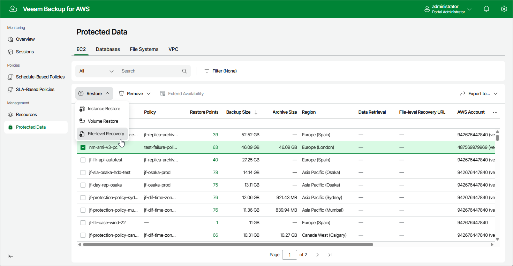

In this article

To launch the EC2 File-level Recovery wizard, do the following:

1. Navigate to Protected Data > EC2.
2. Select the EC2 instance whose files and folders you want to recover.
3. Click Restore > File-level Recovery.

Alternatively, click the link in the Restore Points column. Then, in the Available Restore Points window, select the necessary restore point and click Restore > File-level Recovery.

|  |
| --- |
| Important |
| If you select multiple EC2 instances, you will not be able to proceed with the EC2 File-level Recovery wizard. |

Page updated 9/29/2025

Page content applies to build 10.0.0.232
