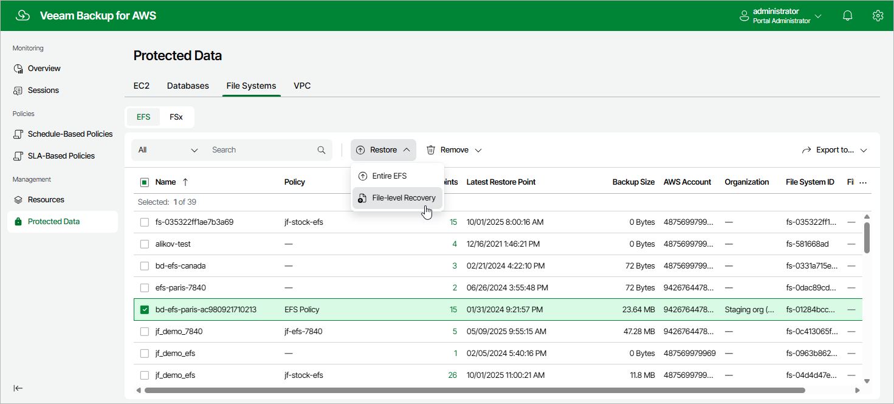

In this article

To launch the EFS File-level Recovery wizard, do the following:

1. Navigate to Protected Data > File Systems > EFS.
2. Select the file system whose files and folders you want to recover, and click Restore > File-level Recovery.

Alternatively, click the link in the Restore Points column. Then, in the Available Restore Points window, select the necessary restore point and click Restore > File-level Recovery.

Page updated 10/2/2025

Page content applies to build 10.0.0.232
