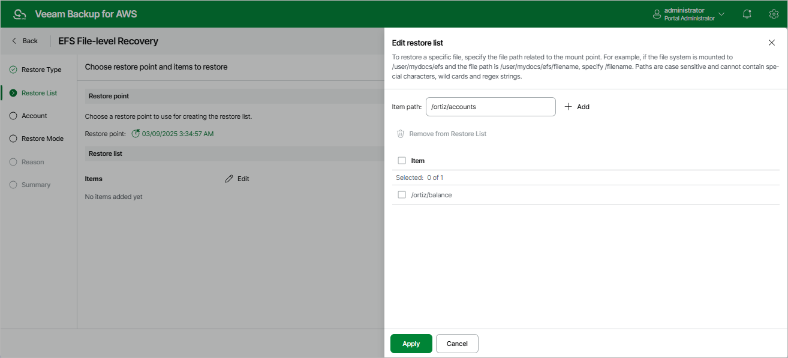

In this article

To add files and folders to the restore list:

1. In the Restore list section, click Edit.
2. In the Edit restore list window, do the following:

1. For each file or folder you want to recover, specify a path in the Item path field and click Add. Note that you cannot add more than 5 paths.

Paths are case sensitive and cannot contain wild cards and regex strings. The following characters are not supported: ? \* : " < > ` .

|  |
| --- |
| Note |
| The specified paths must be related to the mount point of the file system. For example, if the file system is mounted to the /user/mydocs/efs point and the file path is /user/mydocs/efs/file1, specify /file1. |

1. Review the restore list and click Apply.

Page updated 10/2/2025

Page content applies to build 10.0.0.232
