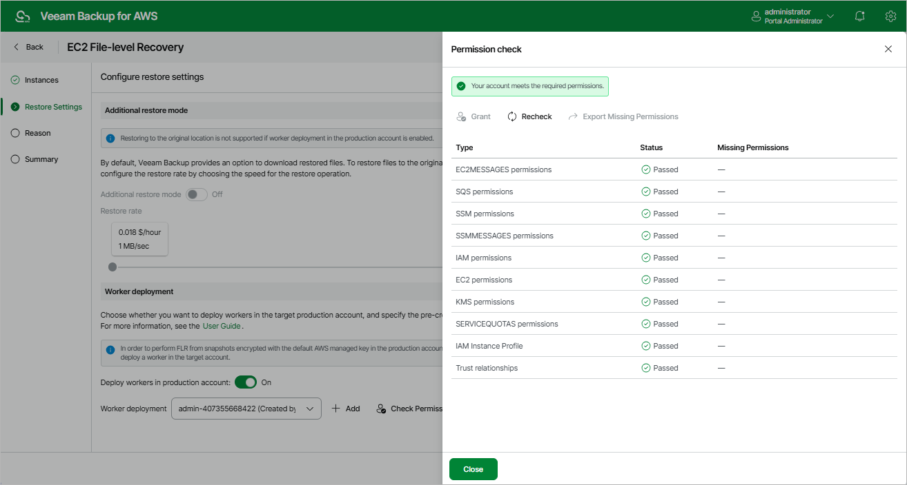

In this article

At the Restore Settings step of the wizard, choose whether you want to restore files and folders to the original location, and to deploy worker instances in the production account.

Configuring Restore To Original Location

[This option applies only if you choose not to deploy worker instances in the production account]

To be able to restore files and folders to the original EC2 instance, set the Additional restore mode toggle to On.

To perform the restore operation, Veeam Backup for AWS will use the IAM role attached to the source instance. That is why before enabling the additional restore mode, assign all the required permissions to the IAM role. For more information on the required permissions, see [Before You Begin](restore_item_before_you_begin.md#original).

|  |
| --- |
| Important |
| * For EC2 instances running Linux OS, restore of files and folders to the original location is supported only for systemd-based distributions.  * For EC2 instances running Windows OS, restore of files and folders to the original location is supported only if Windows Management Framework (WMF) version 5.1 is installed on the processed instances. |

To restore files and folders to the source EC2 instance, Veeam Backup for AWS uses Amazon Kinesis Data Streams. Kinesis Data Streams are charged on a per-shard basis. By default, Veeam Backup for AWS uses streams that are composed of 1 shard with a fixed data transfer rate of 1 MB per second. However, you can change the number of shards in the streams by moving the Restore rate slider. For more information on Kinesis Data Streams, see [AWS Documentation](https://docs.aws.amazon.com/streams/latest/dev/introduction.html).

Enabling Worker Deployment in Production Account

[This option applies only if you have selected a restore point of the Snapshot, Replica or Manual Snapshot type at the Restore Point step of the wizard]

By default, Veeam Backup for AWS deploys worker instances used to perform restore operations in the [backup account](worker_options.md). However, you can instruct Veeam Backup for AWS to deploy worker instances in a production account — that is, an account in which the snapshot that is used to restore files and folders of the source EC2 instance resides. To do that, set the Deploy workers in production account toggle to On.

Depending on whether the EC2 instance belongs to an AWS account or AWS Organization, the following will happen:

* If the source EC2 instance belongs to a single AWS account, you will be able to choose an IAM role that will be attached to the worker instances and used by Veeam Backup for AWS to communicate with these instances. The role you choose must belong to the AWS account in which the snapshot resides, and must be assigned the permissions listed in section [FLR Worker IAM Role Permissions](role_permissions_flr_prod.md).

For an IAM role to be displayed in the list of available roles, it must be added to Veeam Backup for AWS as described in section [Adding IAM Roles](iam_roles_add.md). If you have not added the necessary IAM role to Veeam Backup for AWS beforehand, you can do it without closing the EC2 File-level Recovery wizard. To do that, click Add and complete the Add IAM Role wizard.

* If the source EC2 instance belongs to an AWS Organization, Veeam Backup for AWS will automatically choose the role that will be attached to the worker instances and used by Veeam Backup for AWS to communicate with these instances, depending on the roles [specified in the settings](organization_add_settings.md) of the selected organization identity — either the Production worker IAM role, or the Backup and restore IAM role.

For Veeam Backup for AWS to be able to choose an IAM role automatically, it must be created in all AWS accounts included in the selected organization identity and specified in the organization settings, as described in section [Adding AWS Organizations](organization_add_settings.md#backup_role) (step 3).

In both cases, you will have to assign additional permissions to the IAM role that will be used to perform the restore operation. For more information on the required permissions, see [EC2 Restore IAM Permissions](role_permissions_restore_ec2.md).

|  |
| --- |
| Important |
| If the EC2 instance belongs to an AWS account, it is recommended that you check whether the selected IAM role has all the permissions required to perform the operation. If some permissions of the IAM role are missing, the restore operation may fail to complete successfully. To run the IAM role permission check, click Check Permissions and follow the instructions provided in section [Checking IAM Role Permissions](iam_roles_check.md#wizard). |

Page updated 9/29/2025

Page content applies to build 10.0.0.232
