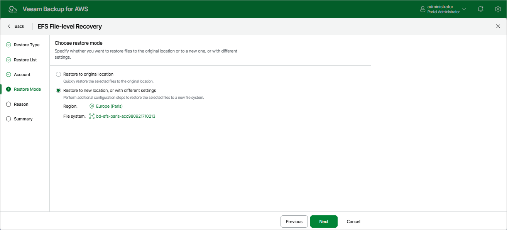

In this article

At the Restore Mode step of the wizard, choose whether you want to restore files and folders to the original or to a custom location. If you select the Restore to new location, or with different settings option, specify the target AWS Region and the file system to which the files and folders will be restored.

Page updated 10/2/2025

Page content applies to build 10.0.0.232
