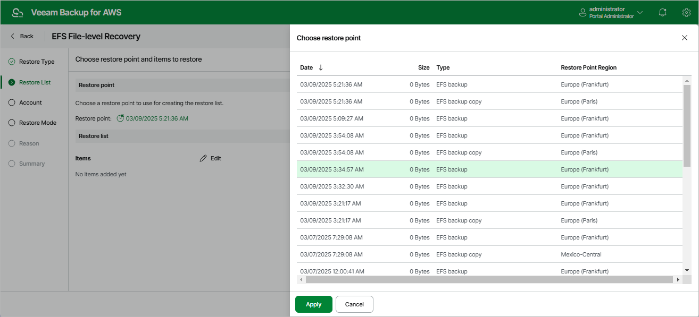

In this article

By default, Veeam Backup for AWS uses the most recent valid restore point. However, you can restore files and folders to an earlier state.

To select a restore point:

1. In the Restore point section of the Restore List step of the wizard, click the link next to the Restore point filed.
2. In the Choose restore point window, select the necessary restore point and click Apply.

To help you choose a restore point, Veeam Backup for AWS provides the following information on each available restore point:

* Date — the date when the restore point was created.
* Size — the size of the restore point.
* Type — the type of the restore point:

* EFS backup — an EFS backup created by a backup policy.
* EFS backup copy — a backup copy created by a backup policy.
* Manual backup — an EFS backup created manually.

* Restore Point Region — an AWS Region where the restore point is stored.

Page updated 10/2/2025

Page content applies to build 10.0.0.232
