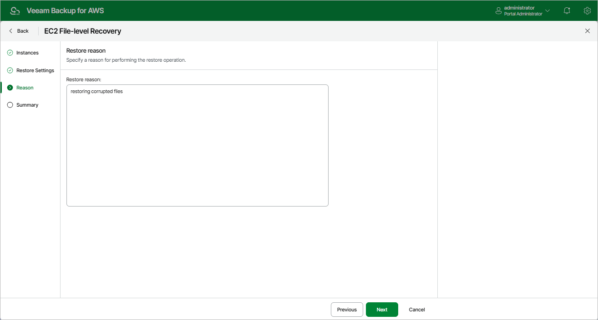

In this article

At the Reason step of the wizard, you can specify a reason for recovering files and folders. This information will be saved to the session history and you will be able to reference it later.

Page updated 9/29/2025

Page content applies to build 10.0.0.232
